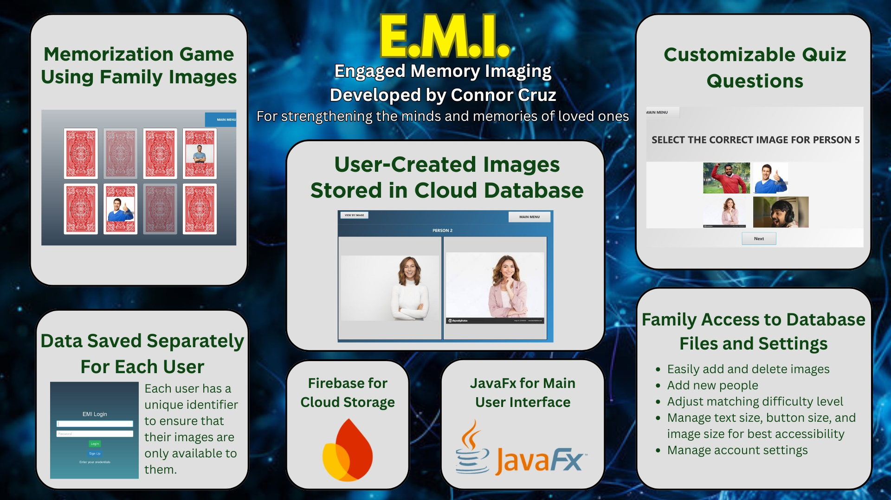

# E.M.I. - A Memorization App for Those with Dementia

## Project Overview

E.M.I. is a dementia-focused cognitive support application designed to support individuals with memory loss through recognition-based interaction, repetition, and personalization. The app emphasizes familiarity over difficulty, allowing users to engage with content that reflects their own lives: family members, important people, and recurring daily concepts.

The project was developed with the ultimate goal of balancing therapeutic usefulness, technical clarity, and emotional sensitivity, ensuring that both users and caregivers can interact with the app comfortably.

## Core Features

**Memory and Recognition Games:**

- Name to face matching games using real people from the user's life
- Image-based recognition activities to reinforce familiarity
- Gentle difficulty scaling

**Cognitive Quiz System:**

- Orientation questions (the day of the week, current month, etc.)
- Family/caregiver-written personal questions
- Multiple quiz modes, including identifying people by image

**Personalized Image Library:**

- Images are organized by the user or viewed collectively
- Scrollablev iews optimized for ease of use and clean aesthetic
- Tap-to-expand images for focused viewing
- Clear name labeling to reinforce recognition

**Caregiver and Family Customization:**

- Family members can add, remove, or update people and images
- Content is personalized to the user rather than unrelated images
- Cloud-backed encrypted storage ensures persistence across sessions and devices, as well as security
- Designed to avoid reliance on fragile local file paths

## Project Location

As of now, this project is limited to select testers and being further improved with new features.

Note that this is an abridged description, as the project has not released to the public yet, so information must remain confidential.