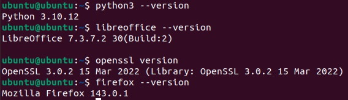
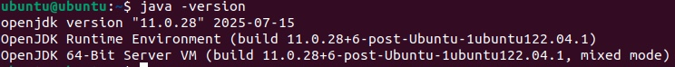
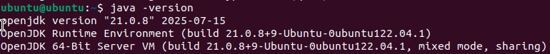
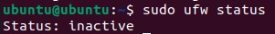
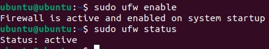
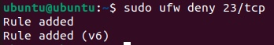
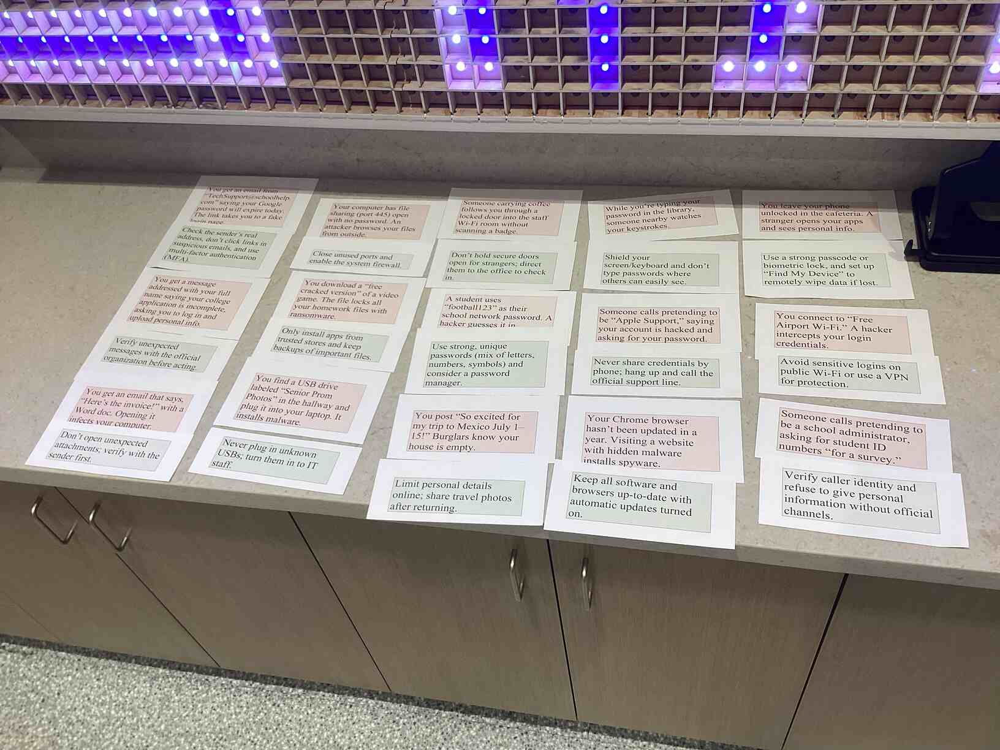
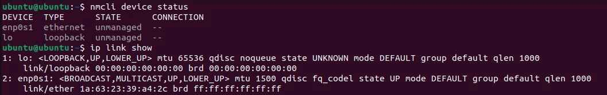
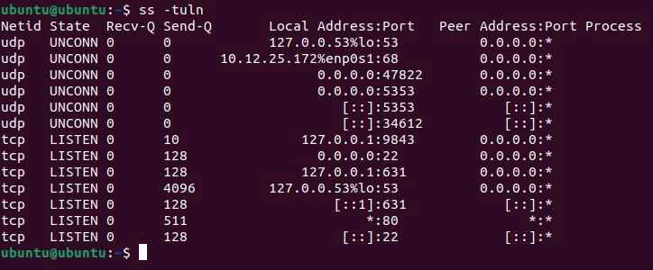
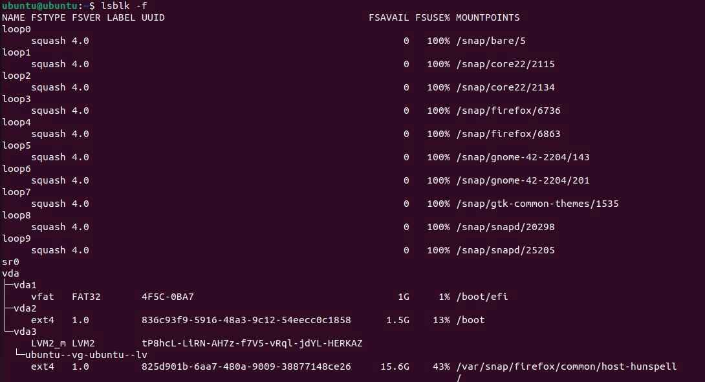

# Determining Security Controls for Devices

## Project Overview

**Problem Statement:**

Many people are unaware of how to secure their data, as well as possible threats which could pose a threat to their security and information. This activity provides an explanation of how the user can secure their devices effectively and the types of attacks to be aware of.

**Objectives:**

- Learn the CIA triad and how to keep information safe
- Compare current software versions with their latest updates, and update them to their latest versions
- Know common device vulnerabilities to look out for
- Know common social engineering attacks which malicious actors use
- Know how to defend from both device vulnerabilities and social engineering attacks

**Success Criteria:**

Fill out a guided note document to retain the knowledge of cyberattacks and defenses, update outdated software, and manage security controls and possible vulnerabilities in an Ubuntu virtual machine.

## Design & Planning

### Cybersecurity Basics for Devices (Guided Notes)

These notes primarily cover three topics: the CIA triad, common device vulnerabilities, and social engineering attacks.

**The CIA Triad**

The CIA triad is an acronym which is defined as follows:

- Confidentiality - keeping information inaccessible to those who should not see it
- Integrity - keep information acurate and trustworthy
- Availability - allow information to be accessed when necessary

Here are some examples of where each of these are expressed:

- Confidentiality is provided mainly through encryption of data, which prevents it from being interpreted without a key.
- Integrity is maintained via backup files and preventing users from tampering with them.
- Availability matters when specific people need access to data, suich as a test administered by the College Board.

CIA is very important for assessing the security of a device or network, and it can help to ensure that data remains safe.

**Common Device Vulnerabilities**

These are some examples of common device vulnerabilities and why they matter:

- Outdated Operating System: If a vulnerability or incompatibility is discovered in an operating system, people may try to take advantage of that vulnerability and access one's device
- Unencrypted Data: If data is accessed, it is able to be interpreted without any trouble by those who shouldn't see it
- Weak Passwords: Easy-to-guess or leaked passwords allow for malicious parties to obtain access to one's data without many boundaries
- Open Ports: Ports allow a device to access the internet, so an open port can allow for someone to remotely access one's operating system
- Unpatched Software: Similarly to an outdated OS, pplications often release patches for security flaws, and failing to update them could result in a security breach

Overall, the specific vulnerabilities which fall into these categories can be accessed via the public database known as **CVE** (Common Vulnerabilities and Exposures). This database is very useful for ensuring that vulnerabilities are assigned a unique identifier and are able to be tracked and fixed in an orderly fashion.

**Social Engineering Attacks**

Social engineering attacks are mostly a result of user error, and they can often be avoided by being careful of one's data and taking proper measures to check an unverified party's authentication.

There are five primary social engineering attacks:

- Phishing: Targeting a large and general group of people by attempting to get them to click a malicious link or perform a malicious action
- Spear Phishing: A subset of phishing which targets a specific set of people (often businesses)
- Pretexting: Using communication with a user to create an image and gain trust, with the intended purpose of getting the user to allow access
- Baiting: Offering a reward, either physical or virtual, to a specific person but instead performing another action
- Tailgating: Entering an open door or insecure location to access a user's device (physical or virtual)

Phishing and Spear Phishing can mostly be prevented by validating the identity of the party who is sending the link/attachment to be opened.

Pretexting and tailgating are most effectively prevented by ensuring the identity and authoriztaion given to a person before trusting them with information.

Baiting is best prevented by being aware of suspicious or unknown devices and avoiding allowing them to connect to one's own devices.

## Technical Development

### Outdated Software

In this activity, students checked software in an Ubuntu VM to determine whether they were: up to date, outdated, or not installed. Since outdated software can often provide vulnerabilities, it is best to update it to the latest available version.

Before checking the versions of the various software, the following commands had to be run to allow the latest versions to be installed if they were not already:

```shell
sudo apt update -y
sudo apt upgrade -y
```

To actually check the versions of software, the name of the software followed by `--version` or some variant is usually used:





Below are the results obtained for different software, as well as the possible risks of leaving that software outdated:

| Software | Status | Risk |
| ------ | ------ | ------ |
| OpenSSL | Outdated | OpenSSL controls encryption, which hides sensitive data |
| Firefox | Up To Date | The browser's cookies could be accessed, which store user information and passwords |
| LibreOffice | Outdated | Documents can become corrupted or made public if vulnerable |
| Python | Outdated | Someone could execute remote commands to perform unwanted actions |
| Apache HTTP Server | Not Installed | Content accessed on the internet could be redirected maliciously |
| GIMP | Not Installed | Images could become corrupted or deleted |
| Java | Not Installed | Remote Java scripts could be executed to perform unwanted actions |
| OpenSSH | Outdated | An unauthorized party could connect to the device remotely via SSH |

Note that a piece of software not being installed is more safe than installing it and leaving it out of date because the software's point of contact with the internet is not made until it is installed. Thus, too much unnecessary and unmanaged software could pose the risk of exposing one's device to the broader internet.

As shown above, most of the software was outdated. Although this does not have much of an impact on a VM with in-school use, if these software were downloaded on a more important operating system, then these outdated versions could post various risks. Personal data could possibly be compromised, or the system could be corrupted and manipulated such that it could not be restored to a previous available version.

To actually update this software, running the software's install command once again usually updates it.

For example, Raaj found a method to install the latest version of Java on the virtual machines despite Ubuntu only natively supporting an earlier outdated version. This command is as follows:

`sudo apt install openjdk-21-jdk`

After updating, here is the displayed version, which correlates to the latest available version of the JDK:



### Cybersecurity Basics for Devices (Defenses)

**Firewalls (UFW)**

To protect against possible attacks and secure the device, multiple methods can be used. Two defense methods in particular will be shown below: firewalls and encryption (via LUKS).

One prominent firewall available on Linux is the UFW (Uncomplicated Firewall), which automatically locks ports deemed unnecessary and allows transportation through open ports.

To enable UFW, it must first be installed using `sudo apt install ufw -y`.

Checking the status can be done with `sudo ufw status`, and the firewall can be enabled via `sudo ufw enable`.

As shown below, the initial status of the firewall is inactive:



However, after enabling it, the firewall is shown as active.



The user can then set up rules to block or open certain ports. In this case, the **telnet** port (23) is very insecure due to lack of encryption, so a rule is created to block it. This can be done using the `deny` command:



Another defense, encryption, is covered in the **Testing and Evaluation** section for this task.

### Social Engineering Attacks/Defenses

This is an activity done with a partner in which scenarios of breached security (red slips) must be paired with remedies to the respective problems (the green slips).



After reviewing the slips once again after learning about specific social engineering attacks, the obtained answers were exactly the same as those obtained previously.

Interestingly, some attacks did not fall into social engineering, but were rather device vulnerabilities.

## Testing & Evaluation

### Outdated Software

While this section was contained in the technical development section, here is a summary of the evaluation of possible vulnerabilities in the virtual machine.

| Software | Status | Risk |
| ------ | ------ | ------ |
| OpenSSL | Outdated | OpenSSL controls encryption, which hides sensitive data |
| Firefox | Up To Date | The browser's cookies could be accessed, which store user information and passwords |
| LibreOffice | Outdated | Documents can become corrupted or made public if vulnerable |
| Python | Outdated | Someone could execute remote commands to perform unwanted actions |
| Apache HTTP Server | Not Installed | Content accessed on the internet could be redirected maliciously |
| GIMP | Not Installed | Images could become corrupted or deleted |
| Java | Not Installed | Remote Java scripts could be executed to perform unwanted actions |
| OpenSSH | Outdated | An unauthorized party could connect to the device remotely via SSH |

More specific information about dealing with outdated software can be found in **Technical Development**.

### Cybersecurity Basics for Devices (Interfaces/Ports)

**Network Interfaces**

It is important to know that Linux has a predictable naming scheme in later versions, which specifies the type of connection, PCI bus, and slot of each interface. An **interface** is defined as a type of connection that the device makes.

For example. `enp0s1` denotes an ethernet connection of PCI bus 0 at slot 1.

The commands shown below obtain the interfaces of the Ubuntu VM and their specific informations:



Knowing these connections can help the user understand the type of connection to the internet and offers certain solutions for if a vulnerability or problem arises.

**Examining Ports**

In bridged mode, the command `netstat -tuln` or `ss -tuln` is run to obtain the assigned ports of the Ubuntu virtual machine and their status. Here is the output of running `ss -tuln`:



Here are some important takeaways to note about these ports:

- Ports set to **LISTEN** are constantly open to receive and send outside traffic, while ports on **UNCONN** have a connection but are only opened when time-sensitive information is pushed.
- The assigning of **LISTEN** to tcp and **UNCONN** to udp is natural since tcp always listens for and is available to send data while udp is for quick communications.
- Certain port numbers are conventionally assigned to particular protocols, as listed below.

Here are some protocols with conventional port numbers present in the VM:

- DNS (Port 53) - assigns text names to IP addresses
- DHCP (68) - obtains an IP from the router/network
- SSH (22) - allows secure remote connection
- CUPS (631) - allows printing

Note that of these ports, SSH and CUPS are not entirely necessary for direct use of the VM (usually unused), as they control interactions with remote devices. Thus, they can lead to vulnerabilities if not managed correctly since they allow outside access to the contents of the virtual machine.

**Encryption (LUKS)**

Encryption ensures that even if a device is compromised or stolen, its data remains secure.

In Linux, a type of encryption called **LUKS Encryption** is used. To check if it is enabled, the command `lsblk -f` can be run:



In the output, the column to keep in mind is **FSTYPE**, as it shows the type of filesystem used for each disk. It is important to note that the **vfat** and **ext4** filesystems are ***NOT encrypted***, so they leave the device unsecure in the case of it being compromised. For LUKS encryption, the filesystem is denoted **crypto_LUKS**, which is **encrypted**. However, as seen above, this filesystem is not present at all in the Ubuntu VM, implying that the disks are not encrypted.

This does not pose much of a risk, especially on this classroom VM, since it does not store personal data. However, if one were to use their main computer, then encrypted filesystems like LUKS are essentially necessary, as personal computers often contain sensitive and private information.

## Reflection & Analysis

Through the *Determining Security Controls for Devices* activity, students learned possible device vulnerabilities, what those vulnerabilities can compromise, and how to fix them. The basic knowledge of the CIA triad (confidentiality, integrity, and availability) allows for introductory knowledge for classification of both vulnerabilities and what is required for an effective defense against them. Knowledge of social engineering attacks, which take advantage of user error, as well as attacks on software and open ports, defenses were also able to be set up on the Ubuntu virtual machine. The enabling of a firewall to block unused ports, updating outdated software, and checking for LUKS encryption are all various methods which were used to ensure the security and integrity of information. Outside of these examples, many casual device users can apply similar steps to ensure that their data is secure and have an alert mind for any possible attacks on their system. This security can generalize to both at-home users, as well as large corporations, who want to abide by the CIA triad for their data. Using knowledge of possible attacks and defenses, a fitting next step is learning how to compromise systems in order to get both perspectives in an attack. This thinking can be applied when setting up defenses, making it further certain that it is very difficult for attackers to compromise one's system.