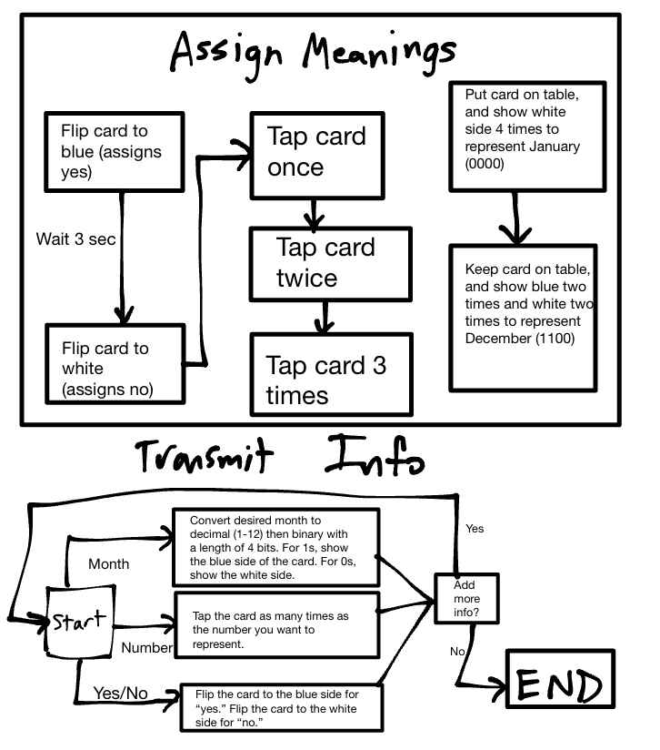
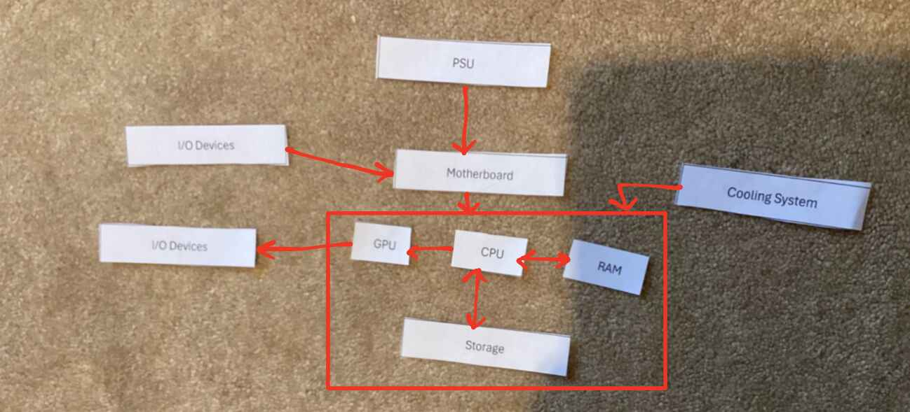
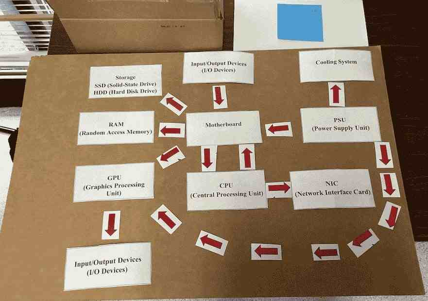
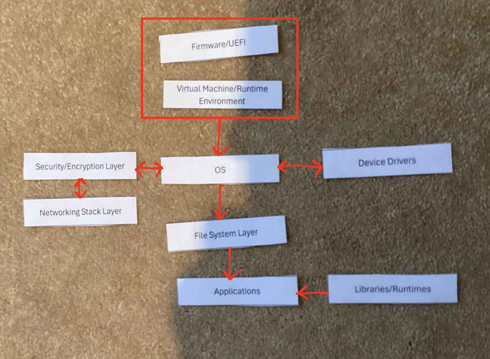
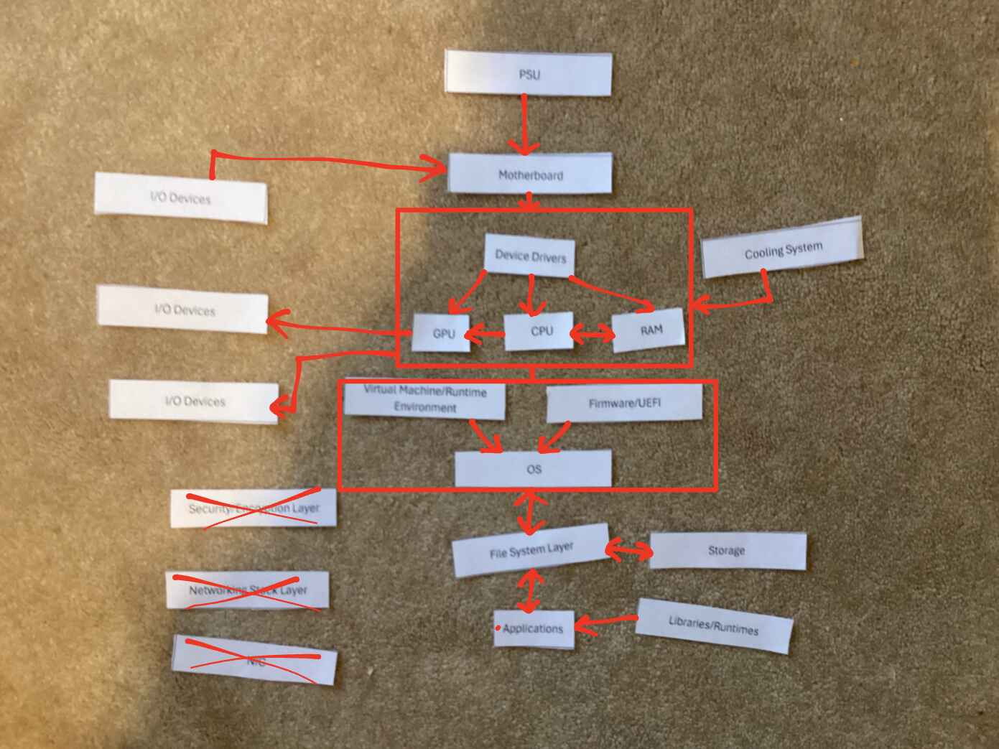

# Component Cards and Software Slips

## Project Overview

**Problem Statement:**

Although many people use computers on a daily basis, few know about the individual components, both hardware and software, which actually control how that computer functions. To remedy this problem, this assignment introduces students to the hardware and how signal flows from one component to the next, as well as how each software component interacts with or allows for the next to perform its function.

**Objectives:**

- Learn what a protocol is and the difficulty of conveying information.
- Know what hardware components are and why they matter.
- Know how each piece of hardware interacts with the rest.
- Learn software and their interactions.

**Success Criteria:**

Be able to identify hardware/software given their definition or function, and also know how to do the opposite. 

## Design & Planning

### Silent Signals

This is a diagram of the finalized protocol for Silent Signals. Specifically, this solves the problem of communicating

- Yes/No answers
- Numbers
- Months

all in the same message, using only a card with two faces: one blue and one white.

Note that this solution requires tapping the card, which was later found out to be prohibited.

### Hardware and Software

**Hardware Diagram:**

The first diagram shows how hardware components interact with each other step by step to type a sentence and save it.

Here is my thought process behind this:

- PSU: Powers the entire system
- Motherboard: PSU connects to the motherboard to power and link the other components
- Cooling system: Applies to everything controlled by the motherboard
- I/O Device (Keyboard): Serves as input for when the user types, so goes into the motherboard
- CPU: Interacts with the RAM and Storage to get/send th text data, and sends data for the GPU to display
- RAM: Stores the typed text short-term
- GPU: Renders graphics and output them on an I/O device (Monitor)
- Storage: When the text is saved, it is stored here

The generally accepted diagram by the class was Arshia's, shown below. This differs from mine in that it shows every interaction between components rather than a step-by-step diagram.

**Software Diagram:**

This diagram shows how the software in a computer interacts to download a file and open it via a graphics program.

Here is my thought process:

- Firmware/UEFI: Starts the computer and allows the OS to run
- Virtual Machine/Runtime Environment: The base of the OS; also necessary for the OS to run
- OS: manages other software applications
- Device Drivers: Go both in and out from the OS to interact with hardware components
- Security/Encryption Layer: Goes in and out from the OS for sending a request and receiving the downloaded file to ensure security
- Networking Stack Layer: Downloads the file and goes through security/encryption layer to protect the OS
- File System Layer: Allows for file management to save the downloaded file
- Applications: Run from the file system layer; in this case, it is the graphics program
- Libraries/Runtimes: Provide necessary resources for groups of applications

**Hardware/Software Diagram:**

This diagram shows how hardware and software interact for printing an English paper.

The interactions on this diagram can be generalized from the others. A notable point is that the device drivers interact between the OS and many hardware components. Furthermore, the Security/Encryption Layer, Networking Stack Layer, and NIC are not necessary because there is no requirement of network connection (assuming a local text editing program such as Word).

## Technical Development

### Components Song:

This song describes the function of computer hardware in a rap beat.

??? note "Lyrics:"

    \[Verse 1\]
    Yo, the brain of the beast, call it CPU,
    Calculatin’ every move, every click you do.
    Clock ticks quick, instructions in a queue,
    Arithmetic and logic, keepin’ it true.

    RAM’s the sprinter, short-term speed,
    Holdin’ what you need, while the programs feed.
    Temporary thoughts, fast as a steed,
    But cut the power, gone—won’t succeed.

    Storage, that’s memory for the long haul,
    SSD’s flash, no spin at all.
    HDD, old school, disks gotta crawl,
    But both save your files, big or small.

    \[Chorus\]
    It’s the tech inside, it’s the heart, the soul,
    Each piece in sync, makin’ the system whole.
    From the brain to the power, every role defined,
    Understand the parts, you control the grind.

    \[Verse 2\]
    GPU, the artist, paintin’ the screen,
    Renderin’ dreams in pixels so clean.
    3D worlds, movies pristine,
    Gamers and creators, it’s the unseen machine.

    Motherboard’s the hub, connections unite,
    Pathways and circuits, keepin’ it tight.
    All roads lead here, no part’s in flight,
    Communication central, day or night.

    \[Verse 1\]
    Yo, the brain of the beast, call it CPU,
    Calculatin’ every move, every click you do.
    Clock ticks quick, instructions in a queue,
    Arithmetic and logic, keepin’ it true.

    RAM’s the sprinter, short-term speed,
    Holdin’ what you need, while the programs feed.
    Temporary thoughts, fast as a steed,
    But cut the power, gone—won’t succeed.

    Storage, that’s memory for the long haul,
    SSD’s flash, no spin at all.
    HDD, old school, disks gotta crawl,
    But both save your files, big or small.

    \[Chorus\]
    It’s the tech inside, it’s the heart, the soul,
    Each piece in sync, makin’ the system whole.
    From the brain to the power, every role defined,
    Understand the parts, you control the grind.

    \[Verse 2\]
    GPU, the artist, paintin’ the screen,
    Renderin’ dreams in pixels so clean.
    3D worlds, movies pristine,
    Gamers and creators, it’s the unseen machine.

    Motherboard’s the hub, connections unite,
    Pathways and circuits, keepin’ it tight.
    All roads lead here, no part’s in flight,
    Communication central, day or night.

    \[Chorus\]

    \[Verse 3\]
    PSU’s the lifeline, feedin’ the juice,
    Convertin’ AC to DC, lettin’ volts loose.
    No power? No play—nothing to produce,
    Wattage on point, keepin’ tight with no excuse.

    NIC’s the bridge, to the net it connects,
    Sendin’ data fast, keepin' all in check.
    Ethernet or Wi-Fi, commands it directs,
    Online or LAN-side, it earns your respect.

    Coolin’ the heat, fans or the liquid flow,
    Keepin’ temps low when performance grows.
    Overclock dreams? You better know,
    Without that chill, your system won’t go.

### Build-A-PC Challenge

In this challenge, a computer was optimized for **gaming** with a $1000 budget. This was also done with a partner.

The given (non-upgraded) components are as follows:
- CPU: mid-range 4-core processor
- RAM: 8 GB
- Storage: 256 GB SSD
- GPU: basic integrated graphics
- PSU: 500W basic model
- Standard cooling
- Basic NIC (network card)
- Motherboard that supports most modern upgrades

Here are the upgrades that were performed:

| Component | Upgrade Chosen | Why It Matters |
| :-------: | :------: | :-------: |
| CPU | High-end 8-core processor ($300) | A good CPU is important for general computer function |
| RAM | 16 GB total RAM ($150) | Good RAM allows more applications to be open which support the game |
| Storage | 512 GB SSD ($150) | Not much storage is necessary unless there are many games; modern games can be up to 100 GB, if not more |
| GPU | Mid-range graphics card ($250) | A good graphics card allows games to be more enjoyable and run more smoothly/cleanly |
| NIC | 2.5 Gbps network card ($100) | Most games need a connection to the internet |
| **Total Cost:** | $950 |

The priority of each upgrade is shown below:

1. CPU
2. GPU
3. RAM
4. NIC
5. Storage

## Testing and Evaluation

Although there was not much testing of the ideas shown in the Design/Planning and Technical Development sections, Silent Signals required testing and evaluation when moving between partners.

**Initial Run-Through:**

With my first partner, we struggled very much to find a common form of communication with the blue and white cards, as there was no way to plan a strategy beforehand. We particularly struggled to represent distance (since it was unitless) and months.

**Between Partners:**

Between partners, a refined method was established for communication since communication with the first partner was very difficult. A modified version of this process is shown above in the Silent Signals diagram.

**Second Run-Through:**

My second parter had also come up with a refined protocol, so we spent the first couple of moments together merging our two protocols. From there, we were able to communicate information much more successfully, and there was less confusion overall. However, since some questions required relaying new types of information that our shared protocol didn't account for, we struggled with these questions.

## Reflection and Analysis

Through the *Silent Signals* activity, I learned the definition of a protocol and how specific and shared protocols are necessary for computers to even convey a small amount of basic information. I refined my protocol to include different types of data to convey, which likely emulates how actual computer protocols are modified to support transfer of many types of information. In *Component Cards and Software Slips*, I learned many things about computer components, software, and their functions, which I had not known before. Most of the new information I learned in this lesson was about the computer software, as I have not had much experience with that in the past. In this activity, I had to carefully think through each process and the involved interactions, which was difficult even with my finished hardware/software diagrams. As a whole, this activity is very useful for understanding the foundation of a computer, which provides the basis of a more robust understanding of other Networking concepts to come (e.g. protocols, data packaging, etc.). While I do think that my diagrams could have some small adjustments and be refined further, they convey the general flow of data well. As such, using them as reference is likely to help for the AP exam and to quickly review what each hardware and software component does.