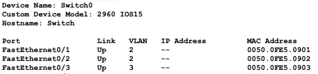
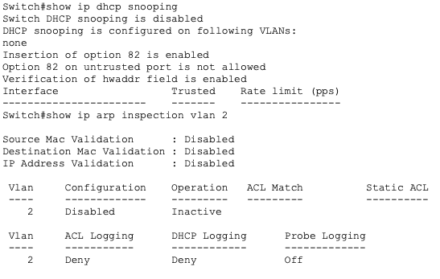

# Switch Security

## Project Overview

**Problem Statement:**

Unconfigured switches can lead to all devices under that switch being vulnerable and easily accessible by other devices.

**Objectives:**

- Understand different switch security threats
- Know controls to protect the switch against certain vulnerabilities
- Apply controls in a simulated situation

**Success Criteria:**

Through threat scenarios, VM observation, network configurations, and network suggestions, understand and suggest solutions to possible vulnerabilities on a switch without proper security controls.

## Planning and Design

### Common LAN Threats & Why Switches Are Vulnerable

**Initial Security Thinking**

The easiest device for an attacker to compromise in a LAN would likely be the switch. Other personal devices usually have security features such as antiviruses and policies to monitor their ports, but an unconfigured switch could allow an attacker to simply connect to an open port. Being "inside" the network makes a device more dangerous than being outside the network. A device inside the network can communicate with other devices in the network, which may allow an attacker to potentially compromise other devices and elevate privileges. A typical device can likely see every other device in a network by default. Since there is no segmentation by default, the device would be able to see any other device in the broadcast domain, which is essentially every device on the network.

**LAN Threat Scenario Observation Table**

| **Scenario** | **Symptoms** | **Hypothesis** | **Justification** |
| -- | -- | -- | -- |
| The default gateway address of several devices is different than expected. | Devices lose internet access, webpages load very slowly or not at all, different default gateway address than expected, no official changes to network, devices still have valid IP addresses | An unauthenticated DHCP server may have been used to give incorrect IP addresses to the devices. | This would cause a different gateway to be listed based on the DHCP server, and it would cause a different router to be listed, which matches expectations. |
| Hundreds of MAC addresses appear to be learned on a single switch port in a very short time. | Network performance is inconsistent, switch shows unusually high CPU usage, issue appears suddenly | An attacker gained access to a specific port and send many invalid ARP requests. | The threat seems to be centered around the port itself, and sending invalid ARP requests would add false MAC address entries to the ARP table. |
| Some devices connecting to the LAN receive IP addresses on the wrong subnet. | Internal resources can't be accessed, some are redirected to unexpected DNS servers, IP information is received quickly, DNS and gateway values are inconsistent | An attacker gained access to the DNS resolution settings of the network and redirects network traffic to undesired locations. | An attack on DNS would not affect the rate of receiving IP information, but rather change the information received. An attack on DNS would also explain the redirects. |
| A previously unseen device appears inside the LAN and communicates with other hosts, and there is activity originating from a wall jack. | The device appears suddenly, traffic patterns resemble a normal workstation, the device has access to other hosts | An attacker connected a personal device to an unmonitored Ethernet port. | This would give them access to the network if port security controls are not enforced well, and the device would act as a normal device in the network. |
| A student workstation is observed communicating with internal systems that should be restricted. | Administrative and server devices are accessed, communication occurs entirely inside the LAN, no authentication failures | The student workstation has permission to communicate with any device on the network due to unassigned permissions. | Since there is no VLAN segmentation, by default, any device can communicate with and read data from any other device. |

### Switch Security Controls - From Observations to Decisions

**Basic Vocabulary**

- Threat - an attack on a network which takes advantage of a vulnerability
- Vulnerability - a weakness in the security of a network
- Control - a means to combat threats or decrease vulnerability
- Prevent vs. Mitigate - preventing is to completely remove a vulnerability, while mitigating is to lessen a vulnerability

## Technical Development

### Common LAN Threats & Why Switches Are Vulnerable

**LAN Observation**

The following output displays the ARP table for the devices on the LAN via `ip neigh`:

An attacker could misuse this information by keeping in mind the IP address paired to the MAC address of a device with elevated privileges. An attacker could use this to their advantage by responding to requests for the device's IP address, thus pairing the attacker's unverified MAC address with the verified IP address.

To see the wrap up and reflection for this subsection, see the respective section in **Testing and Evaluation**.

### Explain, Design, and Defend a Secure Switched LAN

**Mini-Threat Simulation**

The "Compromised Teacher Laptop" scenario was chosen arbitrarily, where a teacher's laptop is infected with malware after opening a phishing email while connected to the school network.

Analysis:

To execute this attack, the attacker must have the teacher's contact information and software that can infect one's system from the browser.

The most directly targeted devices of this attack are the device being compromised and devices on the same subnet, since devices on unconfigured subnets can see all other devices on that subnet.

The only user who would likely notice this attack is the user whose device is compromised, whether that be through increased CPU usage or unfamiliar software.

The Ubuntu Desktop VM best resembles the attacker's perspective because the device being attacked is a common user device. A teacher probably does not have elevated permissions on a school network, so the Ubuntu Desktop VM is mores suitable due to its function as a common device.

### Switch Security Controls - From Observations to Decisions

**Visualizing Switch Security With Packet Tracer**

This activity involves the creation of a small LAN using Cisco Packet Tracer and the enabling and monitoring of security controls on its respective switch.

Part A - Flat Network

The following arrangement in Packet Tracer depicts an unconfigured network composed of a switch with three connected devices:

By default, this network allows communication between all devices, and this communication is allowed to happen without any restrictions. This design assumes trust between devices because if one device were to be compromised, then it could easily communicate with and compromise any other device on the network. This ultimately creates security risk due to lower level devices being able to communicate with powerful administrator devices or devices with private data.

Part B - VLAN Segmentation

The next screenshot shows evidence of the above network being configured into two separate VLANs and each device being assigned to a particular VLAN. The two PC devices, which were connected to FastEthernet0/1 and FastEthernet0/2, are part of VLAN 2, while the Laptop device connected to FastEthernet0/3 is part of VLAN 3.

VLANs change what devices can see by limiting the broadcast range through which they can communicate. This effectively prevents any communication between devices on separate VLANs without approval, despite being on the same router. VLANs reduce broadcast visibility to prevent certain devices from seeing data in separate or unauthorized devices. VLANs alone do not fully enforce security because interaction between devices within the VLAN is still fully unmonitored and authorized.

Part C - Port Security

The following screenshot shows the result of enabling port security on all of the switch ports, effectively allowing the individual configuration of permissions of each port:

Port security relates to physical access in that it manages the permissions of each device connected to that port, allowing for rules to be set and enforced. Thus, anyone who connects to a port with port security enabled will be limited by its rules. Port security primarily helps against attacks where an attacker connects their own device to the network, such as MAC flooding, since these attacks take advantage of unsecured ports. On its own, port security cannot protect against attacks where an attacker pretends to be another device like ARP spoofing because it does not provide user-level authentication.

Part D - Conceptual View of DHCP Snooping, DAI, and ACLs

The following screenshot displays DHCP trust settings and ARP inspection settings for the network:

It is important to note that the above settings are not configured because port security does not activate any of these controls.

Devices that should be trusted are generally security or server devices, since they need to manage other devices and the network as a whole. Devices which should be restricted are devices which are not always part of the network or devices with lower permissions, such as employees, since they should not be able to easily gain access to the data in other devices. The switch should enforce rules on all devices, since rules can both restrict permissions and possibly detect when a device is compromised.

To see the summary table, visit the respective section in **Testing and Evaluation**.

### Explain, Design, and Defend a Secure Switched LAN

**Scenario: School LAN**

The following is a sketch of the proposed network:

Trust and Restrictions:

- Students -> Servers: Denied; Student should not be able to obtain server information and modify the servers
- Students -> Teacher: Restricted; Students should not have access to teacher information, such as grades, but communication should be allowed
- Students -> Administration: Denied; Students should not have access to administration since it manages other devices
- Teachers -> Servers: Denied; Nothing should be able to communiacte with servers except administration
- Administration -> Servers: Restricted; Server access should be allowed to administration but limited for safety

**Trust Enforcement**

The VLAN which should be least trusted is the student VLAN since students should not have the authority and do not have the experience to deal with devices other than their own. The VLANs which require the most protection are VLANs 30 and 40 (Administration and Servers) since they have the most sensitive information and control other devices. The switch should also be the most strict on the Administration and Server VLANs due to the possibility of tampering with other devices.

**Control Layering**

VLANs alone do not fully secure a design because devices can still communicate with each other within each VLAN, and their permissions are not managed at all. Thus, attackers are still able to compromise a device in one VLAN and easily compromise the other devices in the same VLAN. This statement is supported by the mini-task simulation, as neighboring devices in the same VLAN could be easily affected if one device is compromised in the scenario. DHCP snooping is necessary in addition to VLANs because it protects Layer 3 of the OSI layers, mitigating the risk of false IP address assignments and the bypassing of the restrictions set by VLAN segmentation. Dynamic ARP inspection also relies on DHCP snooping because DAI trusts that the ARP table is correctly assigned, and DHCP snooping ensures that IP to MAC address mappings are correct. ACLs are still needed after segmentation to control the permissions of devices within each VLAN since a VLAN simply changes the available broadcast range for each device, while ACLs can manage permissions and more specifically manage device permissions.

To see the Professional Security Rationale, visit the respective section in **Testing and Evaluation**.

## Testing and Evaluation

### Common LAN Threats & Why Switches Are Vulnerable

**Wrap-Up**

The threat scenario with a previously unseen device connecting to a wall jack seems the most realistic. If a school's network is not properly configured, then this could happen unintentionally by connecting a student or other device to the respective wall jack, possibly for charging.

It was also surprising that, inside of a switched LAN with no segmentation, a normal device can see all other device activity and communicate with other devices. This was especially surprising because these are the default settings for a network, rather than an altered state.

### Switch Security Controls - From Observations to Decisions

| VM Evidence | Vulnerability | Control | Why This Control Mitigates Risk |
| -- | -- | -- | -- |
| Flat Network Diagram (Part A)/VLAN Segmentation (Part B) | Devices can freely communicate with one another | VLAN Segmentation | VLAN segmentation limits device communication to other specific devices by limiting their broadcast range |
| Port Security (Part C) | Devices connected to network ports are automatically trusted, leading to them having many permissions | Port Security | This control mitigates the risk of an unathorized party connecting to the network and effectively compromising other devices since it sets security rules for each port |
| Unconfigured DHCP Snooping/ARP Inspection (Part D) | Devices are trusted to have the MAC address that they claim to have, leading to uncertainty in assigning IP addresses | Implementing DHCP snooping and ARP inspection protocols | DHCP snooping mitigates the risk of a rogue DHCP server by ensuring that IP addresses are assigned by valid vendors. ARP inspection mitigates the risk of ARP spoofing by checking whether a device has a valid MAC address to IP address pairing |

### Explain, Design, and Defend a Secure Switched LAN

**Professional Security Rationale**

Control Interaction and Dependency:

While the VLANs present in the proposed design are able to restrict communication between types of devices, the VLANs alone will not effectively mitigate internal risk. The primary weakness of a VLAN is that there is no communication restriction within the VLAN itself. Thus, DHCP snooping must also be included with the proposed network design to establish trusted devices and MAC address to IP address pairings, mitigating the potential risk of rogue DHCP servers. Dynamic ARP inspection further works along with DHCP snooping using its MAC address table to verify that ARP requests contain the correct MAC address to IP address pairings, thus mitigating the internal risk posed within each VLAN. Access control lists further build upon the security of all of the other controls, as they can define specifically which devices can talk to other devices, trusted ports, and desired security protocols. ACLs allow communications, once allowed, to be monitored and restricted as necessary, which none of the previous controls could have done.

Residual Risk and Detection Limits:

While the proposed controls mitigate much risk, lateral movement would still be a very difficult threat for a network administrator to detect. As shown through the outputs of `ip neigh` and other commands, showing MAC to IP address mappings, most of the controls in the proposed network depend on the trusted devices not being compromised. However, if a lateral movement attack targets a trusted device, then no anomaly would be detected in MAC address tables, since another device is not impersonating the trusted device. Thus, the switch's DAI protocol would treat all requests made from the compromised device as if the device were acting normally, giving it all of its usual permissions. Overall, a lateral movement attack takes advantage of the trust that all devices in MAC address tables are trusted and safe, using a compromised device to attack other devices on the network.

## Reflection

Through the *Switch Security* activity, the role of switches as a critical point of control within a LAN was explored in detail, emphasizing how unconfigured switches can introduce significant vulnerabilities. By analyzing common LAN threat scenarios, it was shown that attacks such as rogue DHCP servers, MAC flooding, ARP spoofing, and unauthorized device access can occur when switch security controls are absent. Hands-on observation in virtual machines and Packet Tracer reinforced how flat networks allow unrestricted visibility and communication between devices, increasing internal risk. Implementing VLAN segmentation, port security, and conceptual controls such as DHCP snooping, dynamic ARP inspection, and access control lists demonstrated the importance of layered defenses and trust enforcement within a network. These skills directly translate to real-world IT and cybersecurity practices, where switches are commonly targeted and must be properly configured to protect sensitive systems and data. A logical next step would be actively deploying and monitoring these controls to better understand their effectiveness and limitations. Citations for this assignment include the materials provided by the Charlotte Latin School AP Networking Fundamentals class.