# Routing

## Project Overview

**Problem Statement:**

While LANs can communicate internally, external communication requires separate configurations.

**Objectives:**

- Understand the difference between a private and public IP address
- Understand the purpose of a router and how it converts IP address
- Understand how destination MAC addresses vary depending on the point of transmission
- Know the difference between direct transmission and transmission through the gateway (and loopback)

**Success Criteria:**

Through observation of VM behavior, interaction with external servers, and Cisco Packet Tracer, learn how data is transferred throughout different LANs and within the same LAN.

## Planning and Design

### Your Machine's Layer 3 Identity

**Investigation 1: The Layer 3 Identity**

The following information was gathered for each VM (Ubuntu and Linux): IP address, interface names, and routing table entries.

These were gained via the `ip addr` and `ip route` commands, as shown below:

Ubuntu:

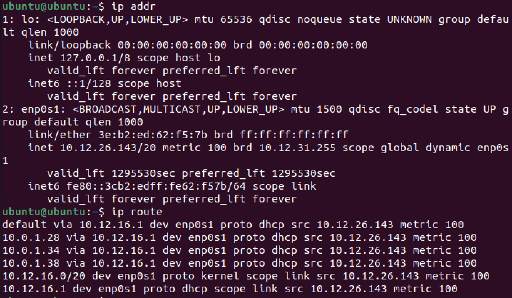

Linux:

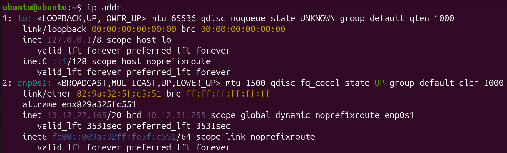

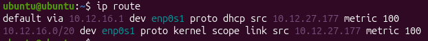

In the above commands, IP address could be found in `ip addr` under *enp0s1*, and interface names were also listed. Routing table entries are listed in order under `ip route`.

Ubuntu:

- IPv4 Address: **10.12.26.143**
- Interface Names: **lo, enp0s1**
- Routing Table Entries: **default (10.12.16.1), 10.0.1.28, 10.0.1.34, 10.0.1.38, 10.12.16.0**

Linux:

- IPv4 Address: **10.12.27.165**
- Interface Names: **lo, enp0s1**
- Routing Table Entries: **default (10.12.16.1), 10.12.16.0**

The IPv4 addresses for these VMs are listed above. They are also both on the **enp0s1** network. A default route is present in both VMs, as shown in the output of `ip route` under *default via*. The gateway device for both is **10.12.16.1**.

In general, the information for a device to send information to itself, devices on its subnet, and devices outside of its subnet is present in the **routing table** (obtained through `ip route`). The default gateway allows connection to other devices outside the subnet, and the other entries provide information to connect to devices on the subnet. The *lo* interface in `ip addr` also allows for a device's connection to itself via the IP address 127.0.0.1. If the default gateway disappeared, then the VM would not be able to communicate with any devices outside of its subnet.

### Who Can See You?

**Your Inside Identity**

First, `ip addr` was run to obtain the IPv4 address of the Ubuntu VM:

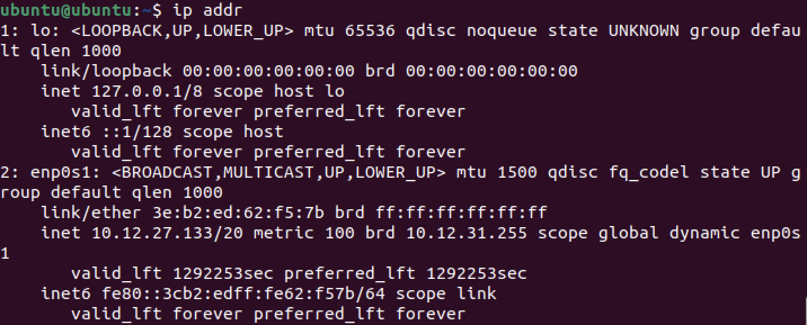

As shown above, under the enp0s1 interface, the IPv4 address is **10.12.27.133**. This address is not globally unique since it is assigned by the router, so another router could assign to another device the same IP address. Another network somewhere else in the world could use the same address because private IP addresses are only used within the network. In general, a difference between public and private IP addresses could help determine this.

Below are the three private IPv4 ranges (RFC1918):

- **10.0.0.0 - 10.255.255.255**
- **172.16.0.0 - 172.31.255.255**
- **192.168.0.0 - 192.168.255.255**

The IP address of the Ubuntu VM, 10.12.27.133, follows under the range with the 10/8 prefix, so it is a **private** IP address.

**Your Outside Identity**

To view the public IP address of the Ubuntu VM, `curl icanhazip.com` was run:

Thus, the public IP address of the Ubuntu VM is **173.95.44.210**.

| **Question** | **Private Address** | **Public Address** |
| -- | -- | -- |
| Are they the same? | 10.12.27.133 | 173.95.44.210 |
| Why or why not? | This is for identification by devices inside of the network. | This is for identification of the network by devices outside of it. |

The machine appears to have two different IP addresses because the private address is used for identification within the network while the public address is used for identification outside of the network. a router/NAT is responsible for the translation of these addresses, since when moving inside or outside of a network, the destination changes from the router to another device. The router/NAT is located at the highest level of the network and is necessary to interact with to reach the internet.

### Following a Packet Across a Router

In this activity, *Cisco Packet Tracer* was used to examine how a packet travels across a router.

**Building the Network**

First, a topology was built with 2 PCs, 2 switches, and 1 router. They were arranged linearly in this order: PC, Switch, Router, Switch, PC. Each device was connected with a copper-straight-through wire:

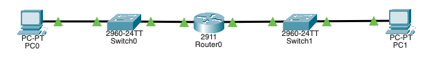

Next, the IP addresses of each device were configured, with PC0 having an IP address of **192.168.1.10** and a default gateway of **192.168.1.1**, while PC1 had an IP address of **192.168.2.10** and a default gateway of **192.168.2.1**. This simulates the two PCs being on different networks:

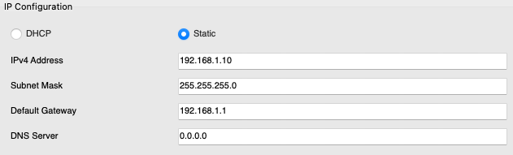

Finally, the router activated the corresponding connections to PC0 and PC1, which caused all interfaces to turn green (connect successfully):

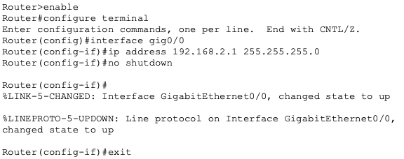

### Determine the Path of Data Using a Routing Tool

**Predict Before Testing**

To start, `ip route` was run on the Ubuntu VM:

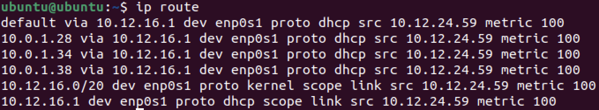

As shown above, the directly connected network is **enp0s1**, and the default route is shown in the first line of the output (designated by "default via"). The gateway IP is next to "default via," which is **10.12.16.1**.

If traffic is sent to the other VM, it would go directly since it is not traveling outside of the network. The first hop would be the other device itself. One hop would be expected since the devices are connected under the same router.

If traffic is sent to 8.8.8.8 (Google), the traffic would go through the gateway. Thus, the first hop would likely be the gateway/router IP. At least three hops would be expected since the router must be accessed, then some intermediary hops, then the final hop to 8.8.8.8.

If traffic is sent to google.com (Google's DNS), the traffic would still go through the gateway. The first hop would be the gateway/router since that remains the same. At least one more hop than 8.8.8.8 would be expected to handle DNS resolution.

## Technical Development

### Your Machine's Layer 3 Identity

**Investigation 2: Sending Traffic**

Case 1: Send Traffic to Itself (Loopback)

The command `ping -c 3 127.0.0.1` was run to ping the device itself via loopback:

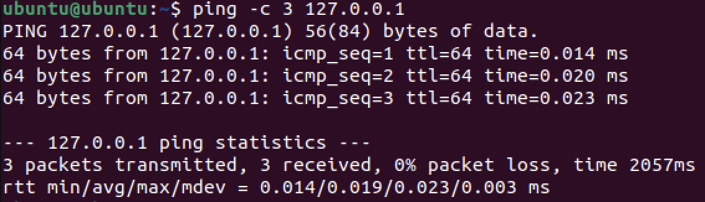

The traffic does not leave the machine because the loopback interface is handled internally and contained in the respective device's hardware. The routing table does not need a gateway entry for this to work because a gateway entry only facilitates communication outside of the subnet.

Case 2: Send Traffic to the Other VM (Same Network)

The ping command was run again with the other VM's IP (10.12.27.165) to test communication:

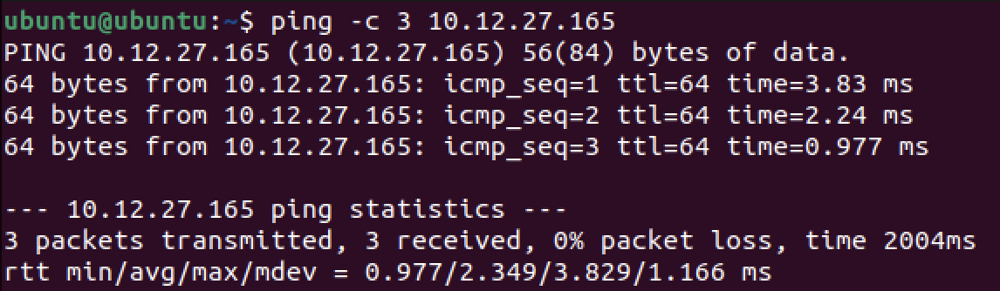

Ubuntu dd not send this traffic to the default gateway because the other VM should be on the same subnet, so no communication outside of the network is necessary. The routing table entry which allows direct delivery can be found through the entry with "scope link", which was found to be **10.12.16.0** in the routing table. This can be proven by running `ip route` and analyzing the output. This is also supported by a slightly longer transmission time than loopback.

Case 3: Send Traffic Off the Network

The Ubuntu VM then pinged Google's IP address (8.8.8.8.8) to simulate external transmission of data:

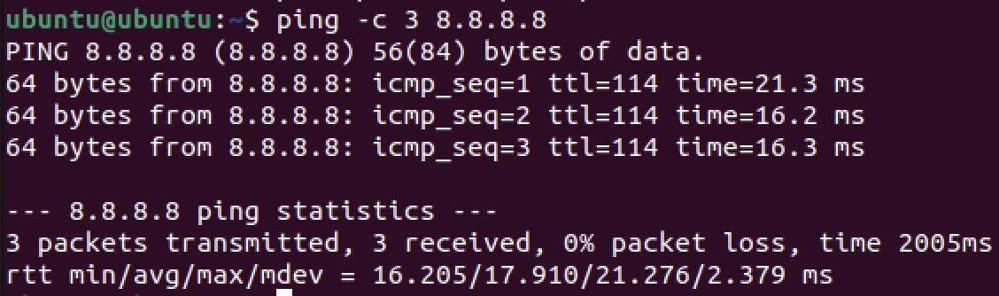

The routing table entry which made this possible is the default gateway, found under **default via** in the routing table. Ubuntu cannot deliver this directly because the router sits as the only way for data to exit the network, so data must pass through it first. This is supported by the transmission times being significantly longer than the other cases. The router device handled the first step outside of the network.

**Investigation 3: How the Decision is Made**

Predictions:

If traffic is sent to the other VM (Linux), the next hop would be direct since no external communication is required. If traffic is sent to 8.8.8.8 (Google), the next hop would be gateway since this does require external communication.

This prediction can be confirmed by `ip route get`, as it shows the direct next hop to reach the device. Below, the first hop of communication with the other VM is shown:

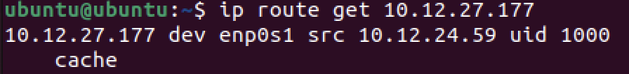

This displays that the first hop is the other VM itself, implying a direct conneciton. Thus, the prediction was correct.

Below is the first hop of communication with *8.8.8.8*:

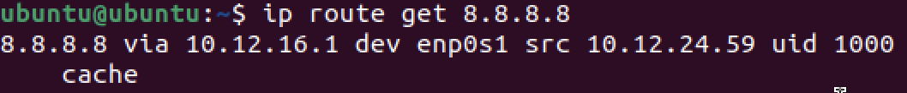

This displays that the first hop is the router (the IP matches), so the next hop matches the prediction.

### Who Can See You?

**The "Can I Reach You?" Investigation**

The private IP address of a partner gained from `ip addr` was pinged in this segment:

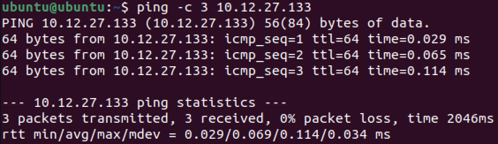

As shown above, all the packets were successfully transmitted, so this communication **succeeded**.

Next, the public IP address of the partner was pinged:

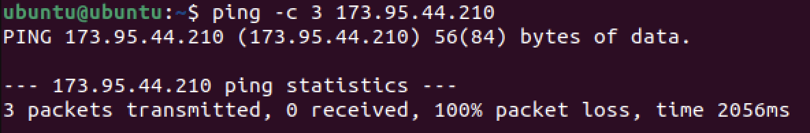

There was a packet loss of 100%, so this transmission failed.

Both the partner's and the local VM share the same public IP because they both belong to the same router. Multiple devices might appear to share one public IP because devices outside of a network identify specific devices within the network by the public IP address of the router and the MAC address. If pinging a partner's public IP fails, the router itself might have a protocol which blocks it. The failure does not mean that the address does not exist, but rather that there is filtering. This is because routers usually prevent interaction with a WAN without permission.

### Following a Packet Across a Router

**Observing Same-Network Communication**

Simulation mode was used for this step. A PDU was first sent from PC0 to the router:

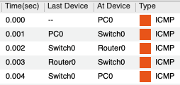

The following is the first transmission step, from PC0 to Switch0:

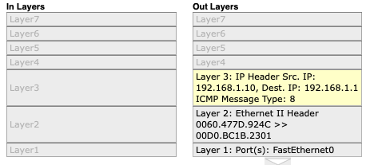

The packet does not go through the router, but instead stays on the left side. This is because to reach it, no communication outside of the network is necessary. Before the first ICMP packet is sent, a header is created with MAC address information for the sender and recipient, as shown above. ARP does not appear during this interaction. The MAC address being used is **00D0.BC1B.2301** (as the recipient).

Below are the in and out layers for the transmission to Switch0 and to the router respectively:

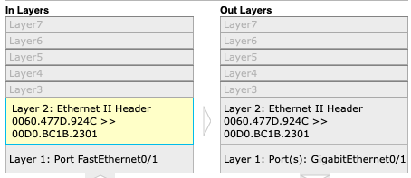

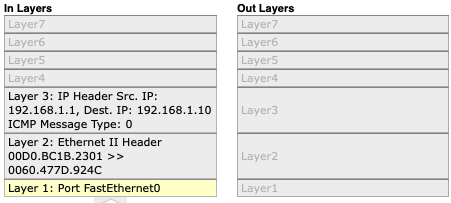

These show that the MAC addresses in the header remain consistent, and that layer 3 is only used at the start and end of transmission to the desire device.

**Observing Inter-Network Communication**

A PCU was then sent from PC0 to PC1:

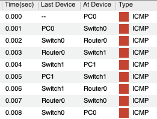

Here is the information when the packet leaves PC0:

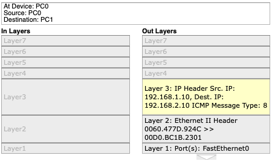

As shown above, the destination IP address is **192.168.2.10**, and the destination MAC address is **00D0.BC1B.2301**.

This is the information when the router is reached:

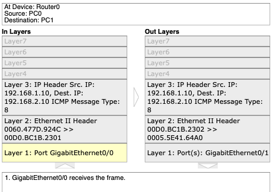

The Ethernet frame changes, with the sender MAC address being changed to the router's MAC address. The destination MAC address is also changed to PC1's MAC address. The router does not keep the same MAC, yet the destination and sender IP addresses remain the same.

Here is the information when it leaves the router to Switch1:

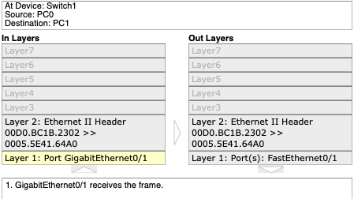

There is no longer any Layer 3 information, but the Ethernet information remains constant, as it is the same as when the router was reached.

In summary, the layer 1 connections travelled and the layer 2 MAC addresses communicating change at each hop, but the layer 3 source and destination IP addresses are preserved from start to finish.

### Determine the Path of Data Using a Routing Tool

**Run Traceroute**

First, `traceroute 8.8.8.8` was run to analyze the route for Google (without DNS):

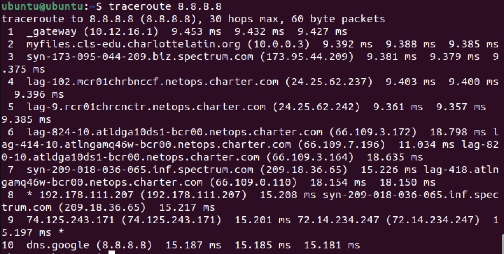

The first hop was shown to be to the gateway, and private addresses stop appearing after hop 2. There are 10 hops in total.

Next, `traceroute google.com` was run to analyze the route for Google (with DNS):

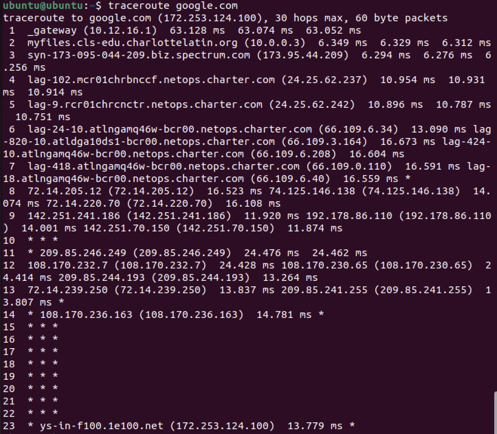

THe first hop is the same as 8.8.8.8, but the total hop count is not the same. The paths diverge at hop 6.

**Interpreting What Was Seen**

Consider the `traceroute` output for Google:

- Hop 1: private IP address; likely the router because it is signified by "_gateway"; inside the LAN
- Hop 2: private IP address; likely the Charlotte Latin School server due to the charlottelatin.org domain; inside the school's overall LAN but not the router's LAN
- Hop 3: public IP address; likely the internet service provider due to the "spectrum.com" domain; inside the ISP
- Hop 4: public IP address; likely a device for the ISP because Charter is a subsect of Spectrum; inside the ISP
- Hop 5: public IP address; likely a device for the ISP because Charter is a subsect of Spectrum; inside the ISP

## Testing and Evaluation

### Your Machine's Layer 3 Identity

**Reflection**

The role of the routing table is to serve as a guide for where a device can communicate and what the best path of transmission is. The role of the default gateway is to provide a path for external communication, allowing access to devices outside of the current subnet. This was proven when communicating with *8.8.8.8*, as `traceroute` showed that the default gateway was one of the hops. For direct delivery, the devices communciating must be on the same network/subnet, as this can only be done if the devices know each other's MAC addresses (which can be found via a MAC address table). Communication with devices outside of the network requires router involvement because the default gateway must first be accessed to reach that device.

### Who Can See You?

**NAT Reasoning**

Private IPv4 addresses are reused in millions of different network because they are limited to specific ranges, and overlap does not matter due to their containment within a network. Private addresses are not routed on the public internet because devices with the same private address cannot be distinguished. If every internal device required its own public IP, then the amount of possible IP addresses, and therefore the length of IP addresses, must be increased, which is very inefficient. A business typically has one public IP but many internal devices so that all outgoing and incoming traffic can be filtered and adhere to company standards. This affects WAN design in that WANs must refer to devices with respect to the network that they are on, using the public IP address.

In a business, when traffic leaves the LAN, the internal VLAN IP addresses are converted into the public IP address of the router/NAT. Segmentation does not eliminate the need for public addressing because a public IP address must still be used for communication outside of the LAN. Segmentation instead increases the importance of controlled translation because the existence of multiple subnets requires the IP addresses within each subnet to be converted to a singular public IP address.

Private IPv4 addresses must exist for scalability because if every device were to have a unique public IPv4 address, then the length of the address must be much longer. This is due to there being much more required public addresses available. Public IPv4 addresses are necessary for global routing because external data is routed given the public IP address of a device, which is then converted to a private IP address once inside a LAN. One device can appear to have two different identities because devices are identified differently within and outside of their respective LANs. Overall, the designation of private and public IP addresses supports WAN architecture because they are easily scalable to large amounts of LANs and devices.

### Following a Packet Across a Router

**Analysis**

The switch never modifies the IP address because IP addresses are used for communication between LANs and dictate where data should generally go. The router must modify the MAC address because the data must first be sent to the MAC address of the router, then outside of the network to the MAC address of PC1. The source IP remains the same from PC0 to PC1 to ensure clarity on what device has sent the packet. In this situation, the "next hop" means the transfer from one device/switch/router to the next one in line. The default gateway is necessary to allow communication across the router because otherwise, data would be stuck on one side of it.

**Failure Thought Experiment**

The router was then deleted, and a packet was attempted to be sent from PC0 to PC1.

Below is the information for the communication between PC0 and Switch0, and Switch0 and the router respectively:

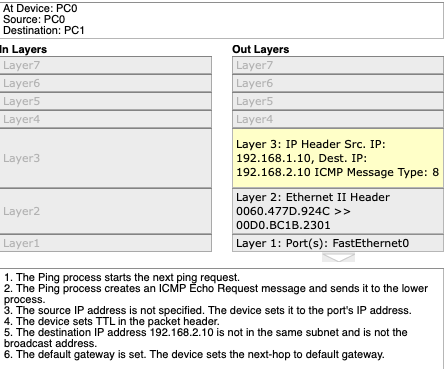

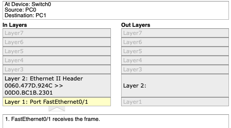

The communication breaks exactly when data is attempted to be output from Switch0, as shown through there being no Layer 2 information present in the out header. Switches cannot solve this problem because they do not have a default gateway nor the ability to change the packet header to specify the MAC address of PC1. The router acts as a gateway between different networks, which no other device can do.

### Determine the Path of Data Using a Routing Tool

**Validating with Routing Table**

Next, `ip route get 8.8.8.8` was run to show the immediate routing decision:

The next hop was found to be the default gateway (10.12.16.1), and the interface is **enp0s1**. This matches the first hop of traceroute, though it does not explicitly mention 10.12.16.1 as a default via.

This was then compared to `ip route get 10.12.27.177`:

The next hop was found to be **10.12.27.177**, which is the other VM's IP address, which differs from the gateway address. This is because the devices are communicating deirectly. The interface remains the same.

In general, `ip route get` only shows one hop because it shows the immediate next hop in the route to a certain device. Meanwhile, `traceroute` shows the entire route.

`ip route get` and `traceroute` both expose layer 3 of the OSI model, as they show how IP addresses interact with each other and send information.

**TTL Experiment**

In this experiment, the maximum hops were limited to 3 using `traceroute -m 3 8.8.8.8`:

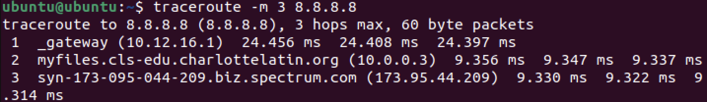

This stops at the ISP (Spectrum) hop because it is the third hop after the Charlotte Latin School servers.

TTL is a setting which can be configured to set a limit to how long a packet is still valid for before being discarded. Routers must decrement TTL to prevent packets with unavailable routes or connection problems from infinitely looping. This allows traceroute to work because it keeps track of the time a certain path takes, allowing the most efficient network path to be found.

**Final Synthesis**

The path of data from a device can be determined using the **traceroute** command and analyzing each hop the data takes before it reaches the device. The first hop represents the immediate device which the current device communicates with when transmitting the data. Private IPs appear early in the path because they are exclusive to the interior of a network, and public IP addresses are used for outside of a network. Two different destinations can share the same first several hops because the same router and internet provider are used, which can route information to other places. A routing-table decision is different from a traceroute path in that a routing-table decision is made theoretically while a traceroute path is made by analyzing TTL. This is supported by `traceroute` having the amount of time of transmission, while `ip route` remains theoretical.

## Reflection

Through the *Routing* activity, the role of routers as means to convert private to public IP addresses was explored in detail, displaying how conversion between private and public IP addresses is necessary for communication between separate LANs. The identification of where different devices are relative to the host device, an Ubuntu VM, displayed how devices within a LAN can be communicated with directly while those outside of the network must first have data transmit through the router. The difference between one's private and public IP addresses wa also examined, and it was found that private IP addresses can be used within a local context, while public IP addresses can only be used globally due to router restrictions and NAT policies. This applies very much in real WANs, as data is transmitted externally and received from outside networks in many networks, whether they be for business, homes, or other scenarios. The exploration of how a packet is transmitted through analyzing hops highlighted how packets will always try to find the most efficient route using TTL, selecting between hops found in the device's routing table. This is especially useful in the real world when large amounts of data are being sent externally, such as in big manufacturing companies. The efficiency of data transmission for large companies, as well as smaller networks, allows for much time to be saved and fewer resources to be used. Thus, these skills translate to configuration of WANs by internet service providers, as well as give knowledge to LAN owners on how to configure routers to handle traffic. A logical next step would be examining how different WANs communicate with each other to send data. Citations for this assignment include the materials provided by the Charlotte Latin School AP Networking Fundamentals class, Cisco Packet Tracer, and Ubuntu.