# Ports & Protocols

## Planning and Design

### Transport Layer Reliability

Before this activity, it is important to understand:

- IP (Layer 3) is responsible for delivering packets between devices.
- TCP and UDP (Layer 4) determine how data is handled once it is being delivered.
- Specifcially, TCP guarantees transmission, while UDP does not and is designed for speed.
- ICMP (Layer 3) determines if the desired device was reachable and is used for error reporting.

### TCP vs. UDP - Comparing Transmission Types

**Predict Before Testing**

TCP is connection-oriented because it establishes a connection and confirms that is is reliable before data transmission, which ensures that data is delivered in order and fully. Meanwhile, UDP is connectionless because it sends packets in no particular order without the creation of a connection. If you send data using UDP and it never arrives, the packet is usually dropped and completely lost, with no notification that the packet failed to be transmitted. TCP likely consumes more overhead due to the resending of packets if they fail to transmit and the requirement that they be transmitted in order.

## Technical Development

### Transport Layer Reliability

**Building and Verifying the Network**

First, a network topology was created with two PCs and a switch, with the PCs being on the same subnet:

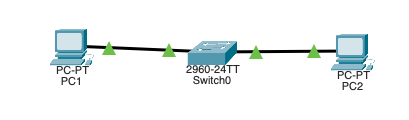

To ensure connectivity, PC1 pings PC2:

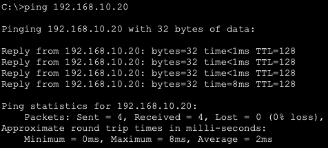

All packets were successfully transmitted, so the connection was successful.

**Observing TCP Behavior (Normal Conditions)**

In simulation mode, TCP traffic was generated by visiting PC2 from PC1's web broswer:

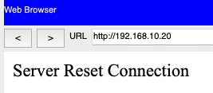

Then, packets were filtered to only show TCP, and the data transmission was simulated.

Observing Connection Establishment:

The first packet sent is shown below:

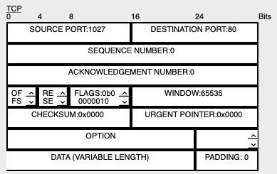

As shown above, the flag appearing in the first packet is 0b0000010, which corresponds to the **SYN** flag. This is used to initiate the connection.

The second packet is shown here:

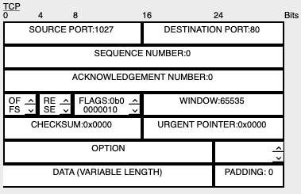

The second packet which appears has the flags 0b00010100 and 0b0000010, which correspond to the **ACK** and **SYN** flags respectively. This shows that the packet was acknowledged, and the connection to PC2 is starting.

The third packet is here:

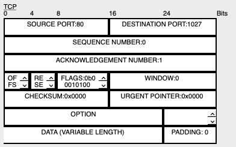

The third packet only has the flag 0b00010100, which corresponds to the **ACK** flag. Thus, the server has successfully received the request, and the connection is made.

In total, data begins to be transmitted after the third packet, since that is the time where data begins to be transmitted from PC2 to PC1.

When analyzing consecutive TCP data segments afterwards, the following sequence and acknowledgement numbers were found:

*For the first packet:*

SEQ: 1293906975
ACK: 1293906976

*For the second packet:*

SEQ: 2587813950
ACK: 2587813951

Both sequence numbers and acknowledgement increase for each subsequent TCP data segment. Since these numbers incraese, the sender does transmit additional data before receiving acknowledgement. This implies that TCP ensures delivery through a constant flow of data back to the sender whenever a packet is sent. If the link were interrupted, the sender would expect to receive a notification and no acknowledgement.

A TCP segment was opened, and the header length and checksum were checked:

The following values were determined:

- Header Length: 32
- Checksum: 0x0000

Checksum is used to detect errors during data transmission by comparing it with the original checksum. If the checksum failed, the receiver would not accept the data since it has been tampered with. If the data were rejected, it would logically be sent again.

**Observing UDP Behavior**

Next, UDP traffic was generated by pinging the other computer (192.168.10.20). The traffic was then observed:

Here is a segment of UDP data:

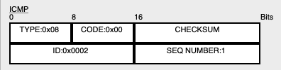

Here are all of the steps of transmission:

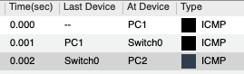

There is not a multi-step connection setup, as the packet starts transmitting immediately after the start of the transaction. Sequence numbers are not visible, and acknowledgement numbers are also not visible. Retransmission is also not visible, showing that there is no handshake in UDP.

| Feature | TCP | UDP |
| -- | -- | -- |
| Connection Setup | Three-Way Handshake | Immediate Transmission |
| Sequence Numbers | Exist and increase | Do not exist |
| Acknowledgement | Exist | Do not exist |
| Retransmission | Retransmits when transmission fails | Does not have retransmission |
| Header Complexity | Many different fields | Minimal fields to decrease size |

### TCP vs. UDP - Comparing Transmission Types

**Observing Listening Sockets**

The command `ss -tln` was run to check the listening sockets of TCP:

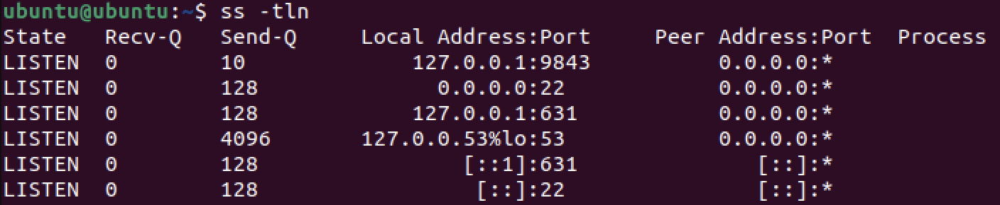

There were 6 listening connections found.

Next, `sudo ss -tlpn` was used to display ports:

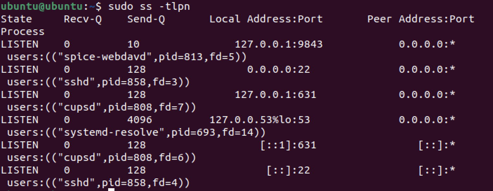

If it were visible, port 22 would be using SSH. However, this does not appear, suggesting that SSH is not being used. This makes sense because SSH involves remotely accessing another device, which was not happening at that time. A port existing means that it has the ability to send or listen data, but it does not guarantee that it is able to be used at that moment. Meanwhile, a listening port guarantees that it is able to accept data at that moment.

Finally, `ss -uln` was run to check for UDP sockets:

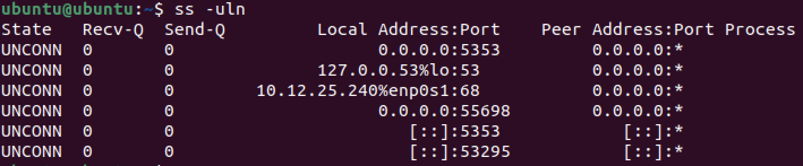

As shown above, the UDP sockets do not show *LISTEN* or *ESTAB*. Instead, the State column shows *UNCONN*, implying that none of the UDP ports are active.

**Live TCP vs. UDP Experiment**

TCP Experiment:

Three terminals were opened. `nc -l 5000` was used on the first terminal to establish a listening connection on port 5000. On the third terminal, `ss -tln` was run to show the active connection. The 3rd socket confirms that port 5000 is open for listening. `nc 127.0.0.1 5000` was used on the second terminal to establish the TCP connection and allow message transfer. Finally, `ss -tn` was run on the 3rd terminal to track the established connections:

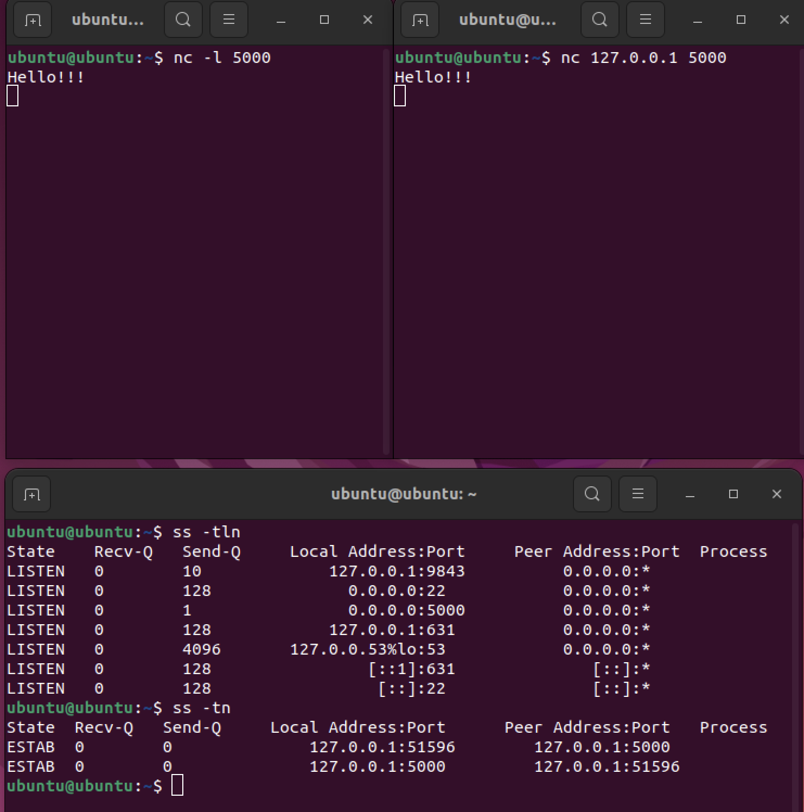

When running `ss`, port 5000 is visible, implying that the connection to port 5000 was successfully active at that time. The evidence found through `ss -tln` shows that there are several listening TCP ports. However, the output of `ss -tn` after the connnection confirms that the connection to port 5000 has passed the listening stage and has been successfully established. Between `ss -tln` and `ss -tn`, the state of port 5000 changed from LISTEN to ESTAB. This proves that TCP is connection-oriented because the connection using netcat changed the state of the connection to port 5000.

Next, the session was closed, and `ss -tn` was run again:

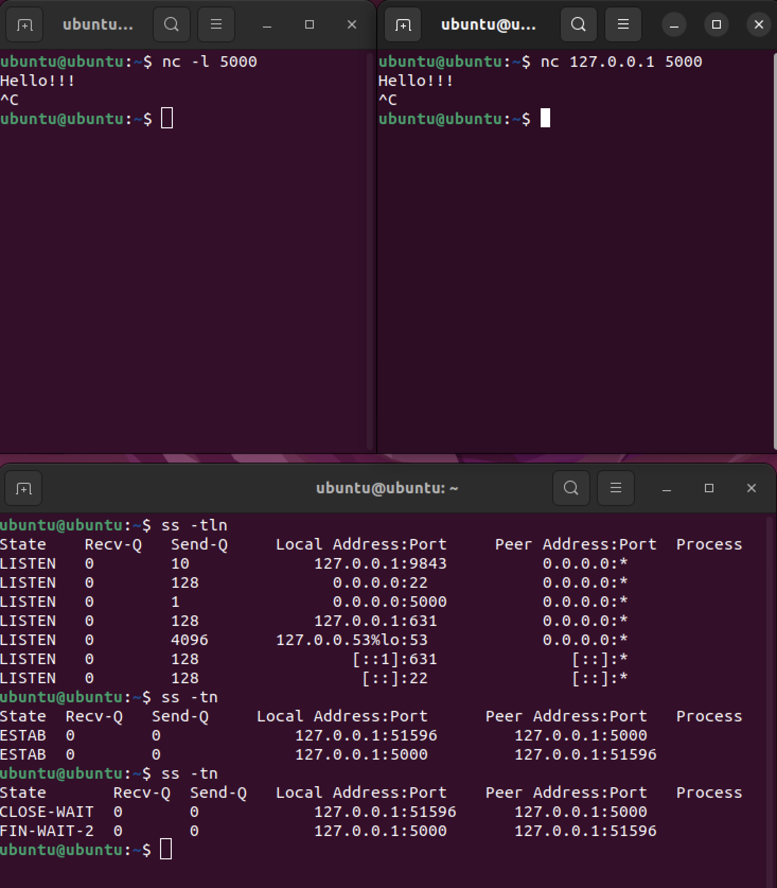

The ESTAB was changed to *FIN-WAIT-2*, showing that the connection was terminated after TCP was ended.

UDP Experiment:

Using the same terminals, a UDP listener was started on port 6000 using `nc -u -l 6000`, and traffic was send using `nc -u 127.0.0.1 6000`. The UDP states of the ports were then found using `ss -uln`:

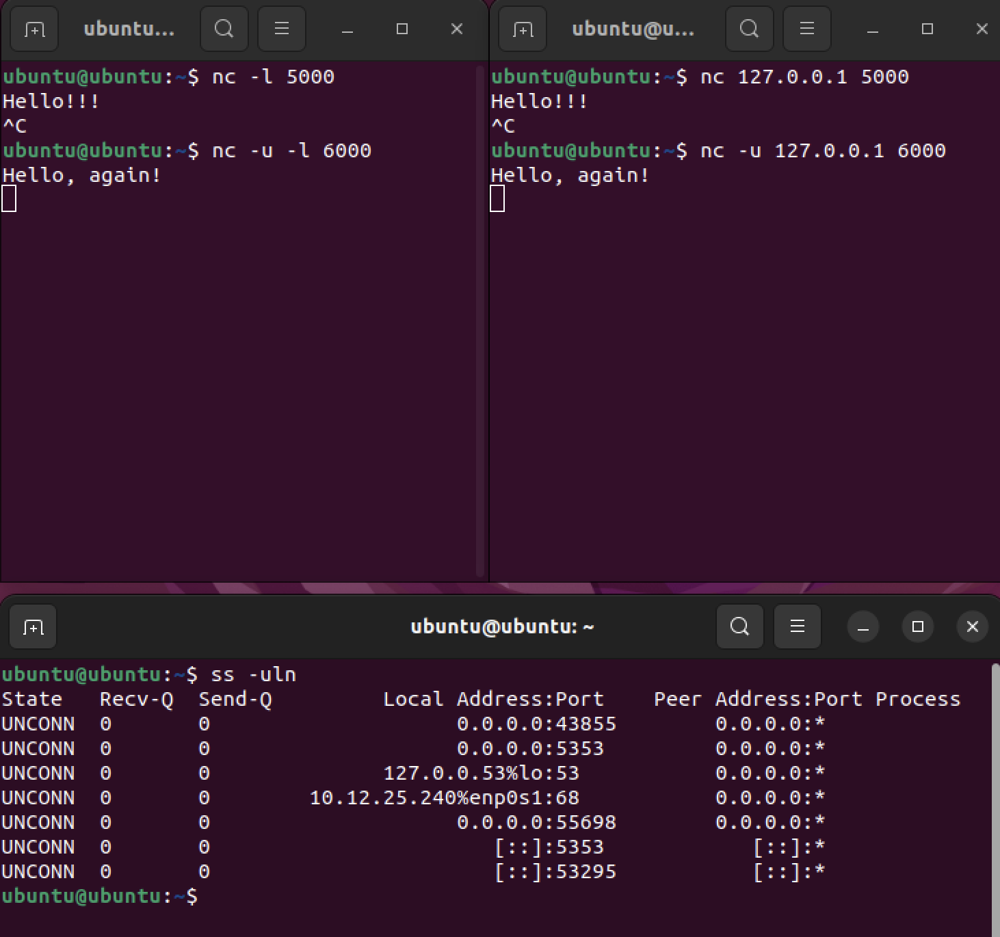

All of the states are unconnected, implying that the socket is open and that no connection was established. This supports the idea of UDP being connectionless.

UDP never shows ESTAB because it is connectionless, so it never establishes a connection to the server. UNCONN implies that, while the port is open, it does not have a connection. UDP does not create a persistent connection state, but rather sends packets individually. If one terminal closes abruptly, then the connection state remains the same due to no connection being established in the first place. There is no formal handshake and no formal teardown. Thus, UDP is structurally different from TCP in that UDP does not establish a connection before transmission and does not require authentication from both sides.

**Port and Ephemeral Port Analysis**

The TCP session was recreated, and `ss -tn` was run again:

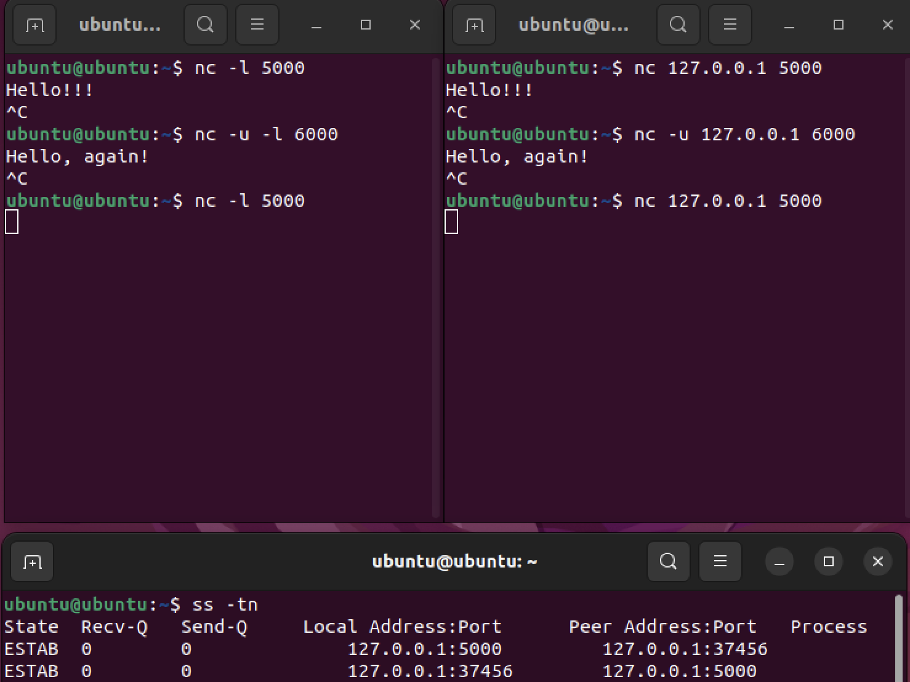

In the output of `ss -tn`, along with port 5000, there is another port with a very large number (37456), which is an ephemeral port. 

The operating sytem assigns an ephemeral port to the client side of a TCP connection so that the connection specifically to the client can be uniquely identified. Thus, if multiple devices are connected, the communication will be with only the intended connection. A listening port remains constant in port number and is where the server listens for connections. Meanwhile, an ephemeral port is assigned to each client of that listening port. UDP does use ports to transfer data, but it does not establish a connection on those ports. Even though we have IP addresses, ports exist to specify what service to send data to or receive data from in a device.

### Investigating OSI Layers 5-7 in a Live System

In this activity, the activity of layers 5-7 of the OSI model were examined in a Linux virtual machine.

**Application Layer Investigation**

First, an HTTP redirect was performed an observed using curl, via the command `curl -I http://example.com`:

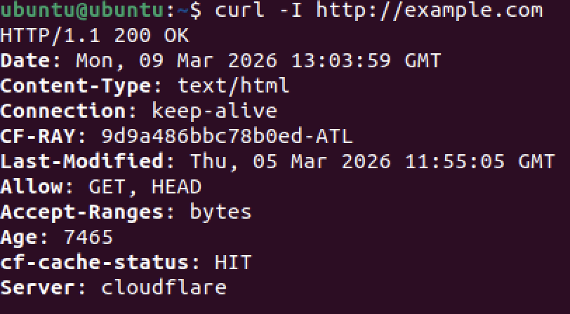

From this output, the following are determined:

- Status Code: 200
- Server: http://example.com
- Content-Type: text/html
- Date: Mon, 09 Mar 2026

When executing this, the HTTP protocol is being used. This is supported by the output of an HTTP status code, implying that it worked in the background. Underneath HTTP is the TCP protocol, which allows for reliable data transmission and access to the website's contents. This is known because HTTP is generally stored on a TCP port due to the importance of reliability. The Application Layer is responsible for interpreting "200 OK", since the application layer must determine the appropriate action to take (in this case continuing to the website).

Next, an HTTPS transaction was analyzed:

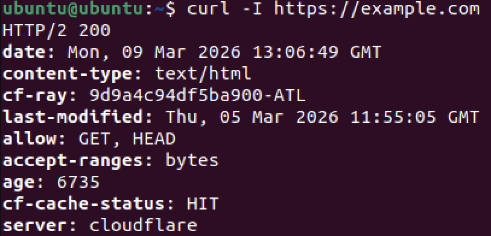

In this output, the interpretation of the status code 200 (OK) is missing, and the connection type is also missing. This is due to the necessary involvement of the TLS protocol, which ensures that the communication and its data are encrypted. HTTP itself does not provide encryption since it strictly acts on the Application Layer (Layer 7), while encryption is primarily executed on layers 6. Encryption logically occurs on this layer (Presentation) since its objective is to format data and ensure adequate encryption.

### Applying Application and Remote Access Protocols Across the Stack

In this activity, multiple protocols were analyzed across different layers.

**Full Stack Analysis: HTTP vs. HTTPS**

The command `curl -I http://example.com` was run to communicate with an HTTP server:

`ss -tn` was used next to check active connections at the time of the curl request:

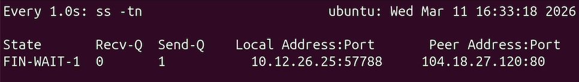

Below is the relevant information from the curl request:

- Destination Port: 104.18.27.120:80 (from `ss -tn`)
- Connection State: ESTAB/Established (from `ss -tn`)
- Transport Protocol: HTTP

The destination port matches what is expected, since HTTP generally runs on port 80.

Next, `curl -I https://example.com` was run to communicate using HTTPS:

`ss -tn` was used again for this URL:

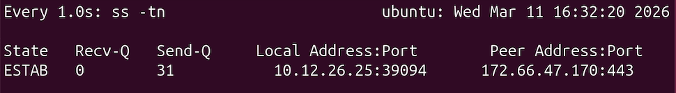

When switching to HTTPS, the application layer changes by TLS, ensuring security. This will cause packet data to be encrypted on the application layer. On the transport layer, the destination port changed to 443, as shown by the output of `ss -tn` displaying **172.66.47.170:443**. This acts as an additional destination before port 80. In HTTP, the port number 80 is involved, while in HTTPS, the port number 443 is involved. Between HTTP and TCP, TLS (Transport Layer Security) appears, ensuring secure communication. TLS does not replace TCP, but rather operates above it, since TCP is still required to facilitate data transmission.

### Investigating HTTP Status Codes and Redirect Behavior

**Observing an HTTP Redirect**

A redirect was analyzed by using *https://slides.google.com*, which should redirect to *https://docs.google.com/presentation*. To view the HTTP response headers, `curl -I https://slides.google.com` was run:

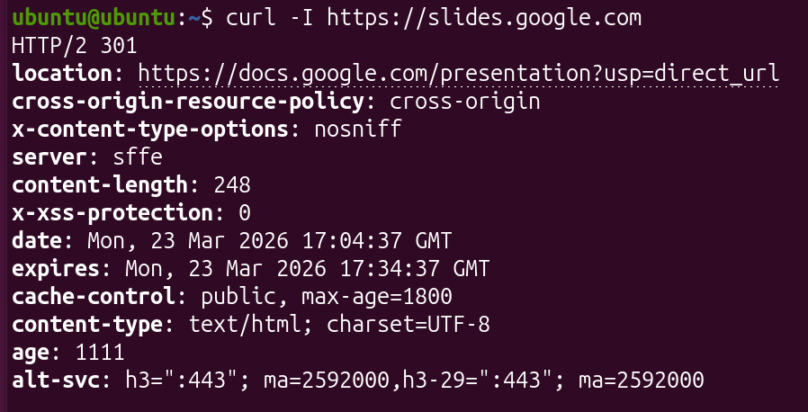

As shown above, the HTTP status code 301 was returned. This code signifies that the requested URL has been permanently moved to the URL listed under the *location* field. The Application Layer (Layer 7) of the OSI model is responsible for interpreting this message, since it determines how the application running the curl command should handle the result of the request.

**Investigating the Redirect Target**

Since the listed URL in *location* was *https://docs.google.com/presentation*, the curl command was next used with this URL:

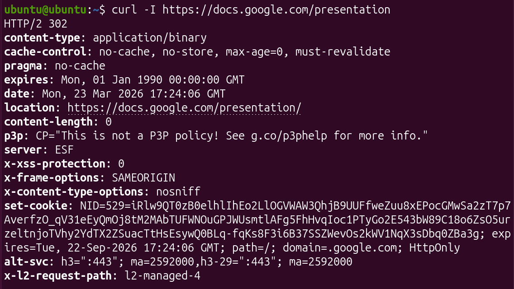

At this time, the HTTP status code 302 was returned. A status code of 301 signifies a permanent redirect to a new URL while a status code of 302 signifies a temporary redirect to another URL. A server may temporarily redirect a request if the request cannot be processed fast enough or if there is maintenance in the server. A web browser would respond to a 301 code by automatically redirecting to the *location* field and notifying the user that the URL they attempted to use is deprecated. Meanwhile, a browser would respond to a 302 code by automatically redirecting the user but telling the user to continue using the requested URL.

**Observing Transport Behavior**

`ss -tn` was then used to display the active TCP connections directly after a redirect:

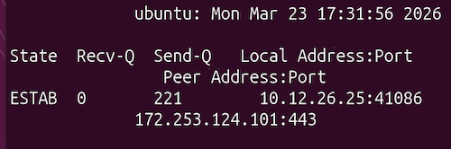

The ESTAB connections confirm that there is still a TCP connection to the remote server when redirecting. Thus, it is confirmed that the Transmission Control Protcol (TCP) carried out the HTTP request. Redirects are handled by HTTP because they only function at the Application layer, while TCP facilitates the actual transfer of redirect requests. TCP only ensures transport reliability and does not act on the Application layer. During this transaction, TLS encryption encrypts both the HTTP request and response during a redirect, ensuring that the request data is secured.

## Testing and Evaluation

### TCP vs. UDP - Comparing Transmission Types

**Reflections**

| Application | Protocol | Why? |
| -- | -- | -- |
| Online Banking | TCP | Banking must always be reliable and stateful |
| Zoom Call | UDP | Low latency is desired when calling |
| Netflix Streaming | UDP | Smooth streaming with little lag is often desired |
| File Download | TCP | TCP ensures that all of the file's contents are transferred |
| DNS Query | UDP | DNS is a simple request, so UDP handles it efficiently with minimal overhead |

The structural difference between TCP and UDP is that TCP establishes a connection while UDP does not. This was shown through the different ss outputs, with `ss -tn` displaying established connections while `ss -uln` displayed that the UDP ports were unconnected. TCP is reliable because it uses a handshake to confirm device identities. TCP also uses sequence numbers to ensure that data is transferred in order, and acknowledgements are made to confirm that data was completely transferred. UDP avoids reliability to minimize overhead and provide fast transmission. Ports enable multiplexing by allowing for multiple connections to be made at once through the use of ephemeral ports. Protocol overhead matters since larger overhead correlates with longer transmission and more information having to be sent.

### Investigating OSI Layers 5-7 in a Live System

**Presentation Layer Investigation**

A TLS handshake was examined via the command `openssl s_client -connect example.com:443`:

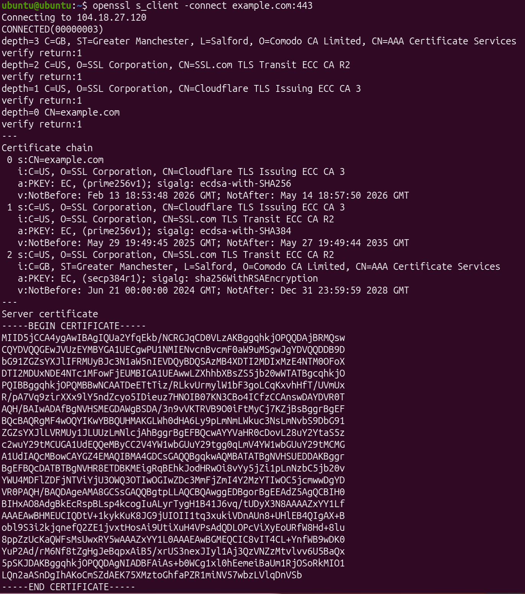

The certificate exchange can be sseen under *Certificate chain*, and the server public key is given at the bottom. The handshape messages are likewise in the certificate chain.

Before data transfer, the public keys of the server and the host are exchanged, as shown in the certificate chain with the fields labeled **PKEY**. TLS does not operate on layer 4 since layer 4 primarily provides the ability of data transfer through protocols such as TCP. However, TLS is usually on layers 5 or 6 due to it providing security in the exchange. A TLS handshake solves the problem of verifying the identity of the server and the host before communication is made. This must occur before application data is sent because once it is sent, the data can be intercepted and used maliciously.

If TLS encrypts data, it does not replace TCP because TLS still does not actually facilitate the communication of the encrypted data. Rather, TLS uses TCP to guarantee the transmission of data, and it works on top of TCP to encrypt the data which is transmitted. TLS needs a transport protocol to function due to its only functions being verification and encryption.

**Session Layer Investigation**

Immediately after running the prior HTTPS curl command, `ss -tn` was run to display active connections:

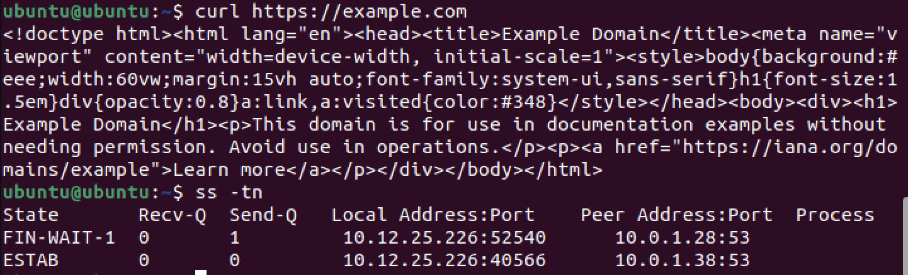

The connection is still active because there is an active state listed under the active connections. It is in the state **FIN-WAIT-1**. The session ends once all of the data in the send queue has been received, which is ultimately decided by the user when they choose to close the connection. If you log into a website with a username and password, that is not handled by TCP, but rather the Application Layer (layer 7). This is because TCP only facilitates transmission, but does not handle the authentication of such transmission. A username and password are passed down from the application as confirmation to lower layers.

**Protocol Identification and Layer Mapping**

| Protocol | Layer | Purpose |
| -- | -- | -- |
| HTTP | Application (7) | Send data between hosts and servers |
| HTTPS | Application (7) | Send data between hosts and servers securely |
| TLS | Presentation (6) | Encrypt data and ensure proper authentication |
| DNS | Application (7) | Converts string domain names into IP addresses |
| TCP | Transport (4) | Allows for reliable delivery of data between devices |

Encryption does not occur at Layer 3 because Layer 3 determines the actual routing of data between devices via IP addresses. This is supported by the function of TLS, which must function between transport and application due to the requirement of securing the data itself. TCP does not handle user authentication because it is only used to ensure the transfer of data between devices, regardless of whether it is secured. Instead, this is done through services such as TLS. Transport reliability, encryption, and application logic are separated so that these policies can be easily changed and debugged independently of each other. If all of these were collapsed into one layer, then a small error in any one of these fields would cause the rest to not function, effectively stopping data communication.

In managing communication state, Layer 5 plays the role of controlling what ports data are transferred to, determining whether TCP-specific or UDP-specific ports should be used. Layer 6 allows for the encryption of sent data, often through the use of a TLS handshake, which was found to confirm the identity of all devices in a transaction. Layer 7 plays the role of relaying data between the client and the server, as seen through the use of the HTTP protocol when using `curl` to access domains. Layer 4 alone is insufficent because there will be no way to diplay the data in a readable format or provide any security in the data transferred.

### Investigating OSI Layers 5-7 in a Live System

**DNS as a Supporting Application Protocol**

To analyze DNS, `nslookup example.com` was run:

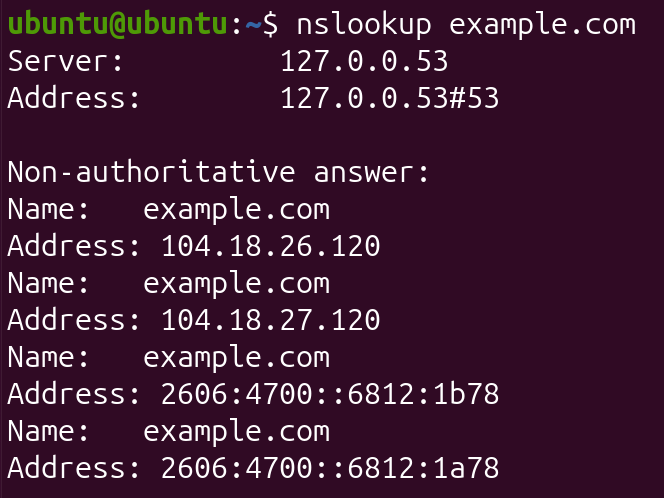

As shown above, the sever and address fields suggest that DNS typically uses port 53. Since DNS is designed to allow efficient access to an IP address via a string, DNS generally uses UDP for efficiency, rather than TCP. DNS does not guarantee delivery in most cases because of its use of UDP. While TCP would ensure delivery, UDP is primarily focused on speed of transmission. DNS might switch to TCP if it is very important that the desired IP address can always be accessed, such as in large businesses.

**Remote Access Using SSH**

Using `ip addr`, the IPv4 address of the host is 10.12.26.25.

Next, `ssh ubuntu@localhost` was used to connect back to the same host device using loopback:

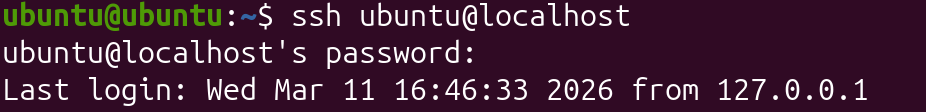

Immediately after, `ss -tn` was run to capture active connections:

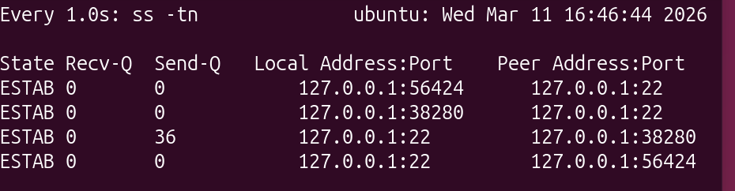

As shown above, port **22** is used by SSH. Using a table, port 22 was found to be a TCP port, so SSH usually acts under TCP. This connection is encrypted because SSH always encrypts the session, regardless of the destination. Although this is a loopback connection, the presence on port 22 and the function of SSH confirm that this connection is encrypted. All OSI layers except for layer 1 (physical) are involved in this SSH request because the user facilitates the request at the application level, and it works down to transmission via MAC addresses. However, since the device is communicating with itself, there is no physical transmission necessary.

**Secure File Transfer**

A dummy file was created under the name *stacktest.txt* using the following command: `echo "Layered Networking Test" > stacktest.txt`.

Next, the SCP protocol was used to transfer the file via loopback with the command `scp stacktest.txt ubuntu@localhost:/home/ubuntu/`:

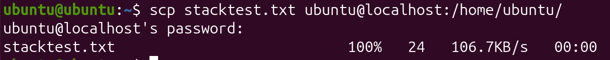

SCP relies on the SSH protocol because SCP transfers files between two hosts. SSH must be used for this since SSH is generally used for data transfer. Since SSH requires TCP, SCP must also require TCP. Since the SSH protocol also encrypts all data transferred through it, SCP also automatically encrypts files transferred. If TCP reliability were removed, then the risk of the failure of file transmission would be posed since it would no longer be guaranteed that all data packets reach the destination. Similarly to SSH, all OSI layers except for layer 1 are involved in this SCP request due to loopback because of its reliance on SSH.

**Stack Mapping**

Below is a stack mapping for an HTTPS request.

| **Layer** | **Protocol** | **Purpose** |
| -- | -- | -- |
| Application | HTTP | Requesting the content and displaying it to the user |
| Presentation | TLS | Ensures that the requested data is encrypted |
| Session | TLS | TLS also maintains the connection and works with TCP |
| Transport | TCP | Provides the means for data to be transferred |
| Network | IP | Determines the routing of packets to different addresses |

SSH requires TCP because it is used to securely login, thus requiring much security and reliability. TCP ensures transmission due to its resending of packets if they fail to transmit, making it the best protocol to use. Encryption is not handled at Layer 3 because Layer 3 is primarily focused on the routing of data, while the securing of that data is typically done at the Presentation or Session layer. HTTP does not provide its own reliability since it already relies on TCP, which automatically ensures reliability. If port numbers did not exist, devices would not be able to distinguish between the different applications and protocols running, which would cause confusion in the Application layer. Remote access should be separated from file transfer protocols since remote access is mainly used to manage another device without copying its contents. File transfer protocols are mainly used for data movement, which is not necessary during a remote access session.

In a single transaction, Application logic can be performed by various user-level tools, such as curl and SSH. Curl (port 443) obtains web data while SSH (port 22) allows remote access, and they both request data from another device. Next, services such as TLS are used in Layer 6 to ecnrypt the data being transferred to and from the host device. The TCP protocol in Layer 4 is designed to guarantee data transmission, with lost or corrupted data packets being retransmitted. Finally, the IP protocol in Layer 3 routes data between devices, ensuring that data reaches the correct host.

### Investigating HTTP Status Codes and Redirect Behavior

**Reasoning About Server Behavior**

A server does not simply send the new page content automatically because the application first needs to receive the new location URL in place of the incorrect URL used in the request. This is received via HTTP request redirect messages. The server instructs the client to make a new request since the server requires a request from the client to actually display a page's content. This provides the advantage of performing maintenance on a website's main URL while still keeping the website functional through the redirected URL. This can also help if a particular server is down, providing an alternate server to access the same service.

## Reflection

Through the *Ports & Protocols* activity, the interaction between transport-layer protocols, ports, and higher OSI layers was explored, showing how reliable and efficient communication occurs. TCP and UDP were compared through simulations and live tests, revealing that TCP establishes a connection, uses sequence numbers and acknowledgments for reliability, and transitions ports from LISTEN to ESTAB, while UDP remains connectionless with unconnected ports. Port numbers, including ephemeral ports, were shown to allow multiple applications to communicate simultaneously, with services like HTTP on port 80 and SSH on port 22 clearly distinguished. Using curl, HTTP and HTTPS transactions demonstrated how the application layer interprets responses while TLS at the presentation layer encrypts data without replacing TCP’s reliability functions. DNS queries highlighted the use of UDP for fast resolution, while SSH and SCP showed how TCP ensures secure, reliable remote access and file transfers. Observing these protocols emphasized how layered design separates transport reliability, encryption, and application logic, enabling flexible and secure communication. Protocol overhead was recognized as a trade-off, with TCP adding extra control information while UDP minimizes delays. These skills translate to real-world networking by helping configure LANs, WANs, and secure connections. Layered interactions were further validated by watching ephemeral ports manage client connections and TLS handshakes confirm identities before data transfer. Overall, the activity reinforced the importance of selecting the appropriate protocol for a given application while understanding how ports and OSI layers work together to maintain reliable and secure data exchange. Citations include the *Charlotte Latin School* AP Networking Class assignments.