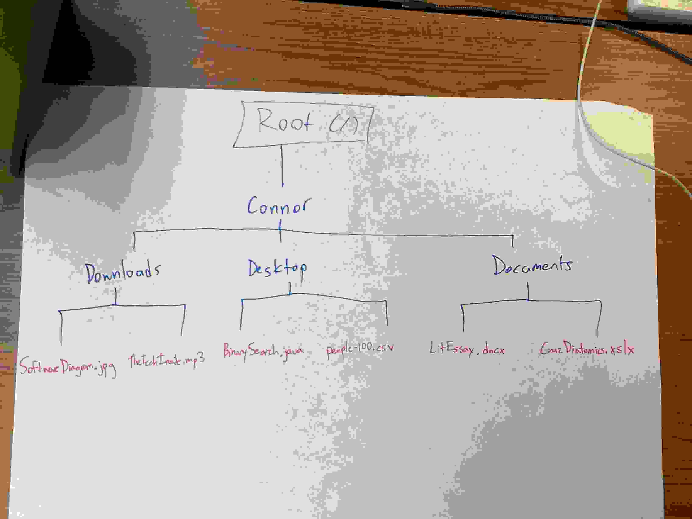
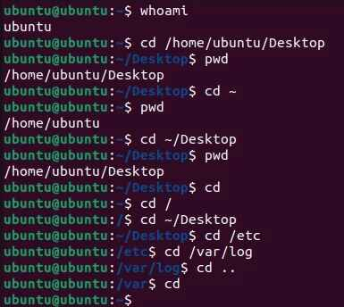
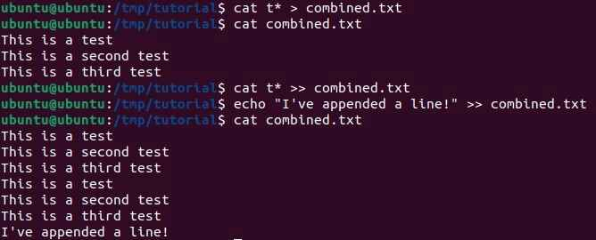
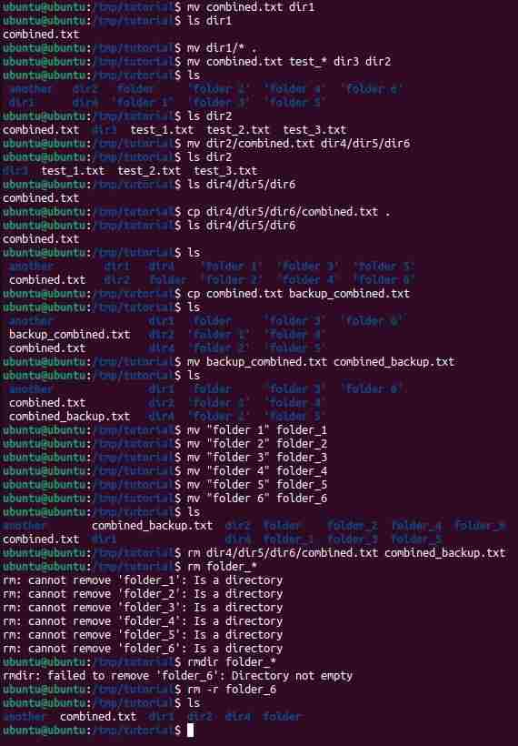
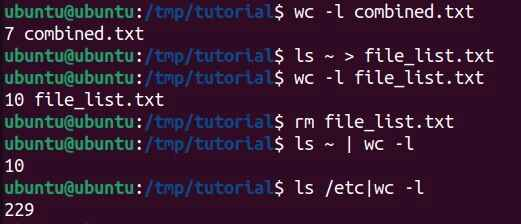
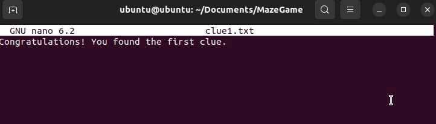

# Command Line Interface

## Project Overview

**Problem Statement:**

In some cases, as well as in the past, having a graphical user interface to interact with a computer either took up very many resources or was simply not available. Thus, this activity teaches students how to navigate and use a command line interface, performing actions such as creating files, moving files, and changing the working directory.

**Objectives:**

- Know what a virtual machine does, as well as applications
- Know how to use a Linux (specifically Ubuntu) virtual machine and deal with the Linux terminal
- Learn basic commands (e.g. pwd and cd) to move through directories and understand absolute vs. relative paths
- Learn how to make, delete, move, copy, and edit files via terminal commands

**Success Criteria:**

Complete several activities, such as "House Sitting Adventure," to demonstrate mastery of command line navigation in the Ubuntu virtual machine.

## Design and Planning

### Due Dates and Objectives

**Map the Maze Part 1**

- Due Date: September 2nd, 2025
- Objective: Learn basic CLI commands

**Map the Maze Part 2**

- Due Date: Septemer 10th, 2025
- Objective: Apply CLI commands in an Ubuntu Virtual Machine, and learn how to navigate a real file system

**House Sitting Adventure**

- Due Date: September 12th, 2025
- Objective: Apply everything learned from the previous activities to navigate a given directory without guidance

### Map The Maze (Part 1)

**Useful Definitions/Examples**

| Term | Definition | Example |
| :-------: | :------: | :-------: |
| Root Directory | The highest directory in the file system from which everything branches | "C:\" for PC, "/" for Mac |
| Folder/Directory | Organizes files or other folders | "Desktop" in the home directory |
| File | Object which stores data; has a name and (usually) an extension | Text documents |
| Path | Shows location of a file/folder in the file system; represents the address of a file | "~/Desktop/notes.txt" |
| Absolute Path | The entire address of a file/folder, starting with the root directory | "/Users/Cruz/Music/song.mp3" |
| Relative Path | The location of a file relative to the working directory | "essay.docx" if the working directory has that file |

**File System Tree Activity**

In this activity, students created an example diagram displaying how directories and files are organized and interact with each other by making a file system tree.

Initially, students were tasked to create a top-down diagram starting from the root directory with:

- A home directory
- Three subfolders
- At least two sample files

Here is the diagram:



Afterwards, that diagram was used to create a text version of the file system tree made previously.

This is the text diagram:

```
/
|_Connor
| |-Downloads
| | |-SoftwareDiagram.jpg
| | |_TheTechInside.mp3
|-Desktop
| |-BinarySearch.java
| |_people-100.csv
|_Documents
  |-LitEssay.docx
  |_CruzDiatomics.xslx
```

**Command Definitions**

| Term | Definition |
| :-------: | :-----------: |
| pwd | Prints the full path of the working directory |
| ls | Lists files/subfolders in the working directory |
| cd | Changes the working directory |
| mkdir | Makes a directory in the working directory |
| touch | Creates an empty file |
| cp | Duplicates a file or directory |
| mv | Moves a file or directory OR renames a file/directory |
| open | Opens a file/directory |
| rm | Removes a file; **CANNOT BE UNDONE** |

**Mac File System Tree**

With the knowledge of basic terminal commands, students were also tasked to create example directories and files in their Mac computers, then navigate through them, doing as follows:
- Create a directory in home called "Practice"
- Make three folders in Practice: Docs, Photos, and Music
- Create a file named "notes.txt" in Docs
- Move notes.txt into Music
- Change the working directory to Music, and print the working directory

These tasks were accomplished using knowledge of the following commands:

- *cd* to change directories
- *mkdir* to create a folder
- *touch* to create a file
- *mv* to move a file
- *pwd* to print the working directory

The final tree structure after this process is:

```
/
|_Users
  |_26cruzc
    |_Practice
      |-Docs
      |-Photos
      |_Music
        |_notes.txt
```

When printing the working directory via 'pwd', this path was obtained: `/Users/26cruzc/Practice/Music`

This matched the path which was obtained through Finder, so it was confirmed that 'pwd' returned the correct working directory.

### The Linux Command Line For Beginners (Tutorial)

This activity allowed for students to learn basic Ubuntu (or othe Linux version) terminal commands and the general layout of Ubuntu's CLI.

The tutorial used can be found [here](https://ubuntu.com/tutorials/command-line-for-beginners#1-overview).

**Opening a Teminal**

This section allowed users to become familiar with these commands learned previously: 'cd' and 'pwd'.

For 'cd', some useful concepts learned were that '~' represents the home directory, and that '..' represents the parent directory.

A new command was also learned: 'whoami', which returns the username of the person running the command.



**Creating Folders and Files**

Note that many of the commands run are not shown due to the computer running the VM being reset. However, the part shown summarizes the concepts learned.

In summary, this part of the activity taught the following:

- Linux's CLI makes it such that 'mkdir word1 word2' makes two separate directories 'word1' and 'word2' rather than 'word1 word2'
- Spaces (and other special characters in Linux CLI) can be escaped using the '\' character
- The '>' command writes the output of a command to a file
- 'echo' returns its argument
- 'cat' with more than one argument concatenates the contents of files as a single block of text
- '>>' appends an output to a file



**Moving and Manipulating Files**

This section goes over commands to move, copy, and remove files, which were mostly dealt with in *Map the Maze Part 1*:

- 'mv' moves the first arguments into the final argument
- If 'mv' is run with two file/directory arguments of the same type, it will rename the first argument to the second
- 'cp' copies its first arguments into its last argument (which can be either a file or directory)
- 'rm' can remove a file but cannot remove a directory
- 'rmdir' is used to remove directories
- 'rm -r' remoevs a directory and all of its contents, which can be dangerous



**A Bit of Plumbing**

Although this section was not required, it is useful to know for general use. It primarily introduced the **pipe command**:

- The output of the left side of the pipe command '|' is input as an argument to the right side of the pipe command
- Multiple pipes can be used in succession, going from left to right
- 'sort' sorts the contents of a file alphabetically
- 'wc' gets the word count of a file, and 'wc -l' gets the line count



**The Command Line and Superuser**

This section goes over permissions:

- The 'su' command allows the user to change to the root user without logging out and logging back in
- 'sudo' is a prefix to a command which is to be run with administrator privileges

While there was some code written for this segment, it does not pertain much to the concepts taught.

**Hidden Files**

This section briefly taught about how to denote hidden files:

- Hidden files/directories always start with a '.'
- To reveal hidden files/directories when using a command, add the '-a' switch

### Troubleshooting Network Issues

This assignment explained the **fundamental troubleshooting process:**

1. Determine if the device is connected.
2. Check if the device is assigned an IP address.
3. Check if the device can reach the internet.
4. Check if DNS is functional (i.e. it can look up names).

**Device Connection/IP Address**

To check for a device's IP address (on a Mac), one must use the `ifconfig` command. If the Mac is connected to the router via ethernet, an active IP address should be displayed on *en0*. However, if it is connected to the router via Wi-Fi, *en1* should be active instead.

Here is the output when `ifconfig` was run:

INSERT OUTPUT

Note that the Mac connected to the router via Wi-Fi, so *en1* being active makes sense.

To see what happens when the device is not connected, the Wi-Fi was turned off on the Mac by toggling the Wi-Fi switch. As a result, both *en0* and *en1* became inactive:

INSERT OUTPUT

When reconnecting to Wi-Fi, the same results as the initial run  of `ifconfig` were output.

**Reachability**


## Technical Development

### Map The Maze (Part 2)

Using the commands learned during *Map The Maze (Part 1)*, they were similarly applied to the terminal of a Linux virtual machine running on Ubuntu. This activity also entailed linking a directory in the host system to the virtual machine and moving files between them.

This command was used to print the working directory, serving as a review of previously learned concepts:

```bash
ubuntu@ubuntu:~$ pwd
/home/ubuntu
```

This segment changes the directory to 'Documents' and prints the working directory, which is confirmed to be Documents:

```bash
ubuntu@ubuntu:~$ cd Documents

ubuntu@ubuntu:~/Documents$ pwd
/home/ubuntu/Documents
```

In Documents, the MazeGame directory was made using 'mdir', and 'ls' confirms that it was made successfully:

```bash
ubuntu@ubuntu:~/Documents$ mkdir MazeGame

ubuntu@ubuntu:~/Documents$ ls
MazeGame
```

This segment moves the working directory to MazeGame and creates three txt files using the 'touch' command:

```bash
ubuntu@ubuntu:~/Documents$ cd MazeGame

ubuntu@ubuntu:~/Documents/MazeGame$ touch clue1.txt clue2.txt clue3.txt

ubuntu@ubuntu:~/Documents/MazeGame$ ls
clue1.txt clue2.txt clue3.txt
```

Nano is used to edit clue1.txt:

```bash
ubuntu@ubuntu:~/Documents/MazeGame$ nano clue1.txt
```

Here is the nano UI, which allowed for clue1.txt to be written to and saved:



This segment copies clue1.txt to '~/hostshare', which required administrator priviliges. To obtain these privileges, 'sudo' was used:

```bash
ubuntu@ubuntu:~/Documents/MazeGame$ sudo cp clue1.txt ~/hostshare
[sudo] password for ubuntu:

ubuntu@ubuntu:~/Documents/MazeGame$ ls ~/hostshare
clue1.txt
```

To copy a file from the Mac to MazeGame, the 'Shared Directory' value in the UTM had to be changed. For the purposes of this assignment, the 'Desktop' folder in the host system was chosen.

After restarting the VM, it was then required to link ~/hostshare and the shared directory (Desktop) via the following command:

```bash
ubuntu@ubuntu:~$ sudo mount -t davfs http://127.0.0.1:9843/ ~/hostshare/
```

The directory is changed to hostshare, and 'ls' confirms that th files from the host system's Desktop folder are shared. 'mv' is also used to move the screenshot in hostshare to MazeGame:

```bash
ubuntu@ubuntu:~$ cd hostshare

ubuntu@ubuntu:~/hostshare$ ls
'Screenshot 2025-09-05 at 2.23.11 PM.png'

ubuntu@ubuntu:~/hostshare$ mv 'Screenshot 2025-09-05 at 2.23.11 PM.png' ~/Documents/MazeGame

ubuntu@ubuntu:~/hostshare$ cd ~/Documents/MazeGame
```

This command confirms that the screenshot was successfully moved to MazeGame:

```bash
ubuntu@ubuntu:~/Documents/MazeGame$ ls
'Screenshot 2025-09-05 at 2.23.11 PM.png'   clue2.txt
clue1.txt                                   clue3.txt
```

Similarly to above, 'ls' is run, but with the '-a' switch added. This switch allows for all files/directories to be shown, including hidden files:

```bash
ubuntu@ubuntu:~/Documents/MazeGame$ ls -a
.   'Screenshot 2025-09-05 at 2.23.11 PM.png'   clue2.txt
..  clue1.txt                                   clue3.txt
```

Another student created a sercet file on this VM. This file was found using 'ls -a' and printed using the 'cat' command:

```bash
ubuntu@ubuntu:~/Documents/MazeGame$ ls -a
.   .secret.txt                                 clue1.txt   clue3.txt
..  'Screenshot 2025-09-05 at 2.23.11 PM.png'   clue2.txt   

ubuntu@ubuntu:~/Documents/MazeGame$ cat .secret.txt
This is secret :O
```

## Testing and Evaluation

### Map The Maze (Part 3)

To evaluate students' knowledge of the command line interface, they used Linux commands to navigate and modify a pre-made 'House' directory. 

The GitHub repository in which this directory can be found is linked [here](https://github.com/thewangclass/CK-Building-Content-Knowledge-Workshop).

To start, the commands below perform the following:

1. Navigate into the house directory using 'cd'
2. Check possible places to navigate to using 'ls'

```bash
ubuntu@ubuntu:~/Documents/CK-Building-Content-Knowledge-Workshop/Unit 1 Activity
- House Exploration$ ls
README.md house

ubuntu@ubuntu:~/Documents/CK-Building-Content-Knowledge-Workshop/Unit 1 Activity
- House Exploration$ cd house

ubuntu@ubuntu:~/Documents/CK-Building-Content-Knowledge-Workshop/Unit 1 Activity
- House Exploration/house$ ls
bedroom1    bedroom2    garage    kitchen   main_entrance

ubuntu@ubuntu:~/Documents/CK-Building-Content-Knowledge-Workshop/Unit 1 Activity
```

The next segment completes the following:

1. Navigate into the main entrance (using 'cd')
2. Find and open a set of instructions in the main entrance (using 'ls' and 'open')
3. Return to the house level (using 'cd')

```bash
ubuntu@ubuntu:~/Documents/CK-Building-Content-Knowledge-Workshop/Unit 1 Activity
- House Exploration/house$ cd main_entrance

ubuntu@ubuntu:~/Documents/CK-Building-Content-Knowledge-Workshop/Unit 1 Activity
- House Exploration/house/main_entrance$ ls
instructions.txt    unopened_mail1.txt    unopened_mail3.txt
shoerack            unopened_mail2.txt

ubuntu@ubuntu:~/Documents/CK-Building-Content-Knowledge-Workshop/Unit 1 Activity
- House Exploration/house/main_entrance$ open instructions.txt

ubuntu@ubuntu:~/Documents/CK-Building-Content-Knowledge-Workshop/Unit 1 Activity
- House Exploration/house/main_entrance$ cd ..
```

This segment checks the kitchen, "eats food" (deletes files), and checks for hidden files. Using 'rm' successfully removed the two food items specified.

```bash
ubuntu@ubuntu:~/Documents/CK-Building-Content-Knowledge-Workshop/Unit 1 Activity
- House Exploration/house$ cd kitchen

ubuntu@ubuntu:~/Documents/CK-Building-Content-Knowledge-Workshop/Unit 1 Activity
- House Exploration/house/kitchen$ ls -a
.   ..    .rotten_bananas   banana    cereal    crackers    donut   milk    orange

ubuntu@ubuntu:~/Documents/CK-Building-Content-Knowledge-Workshop/Unit 1 Activity
- House Exploration/house/kitchen$ rm cereal .rotten_bananas

ubuntu@ubuntu:~/Documents/CK-Building-Content-Knowledge-Workshop/Unit 1 Activity
- House Exploration/house/kitchen$ ls -a
.   ..    banana    crackers    donut   milk    orange
```

This next segment searches the bedrooms thoroughly and checks the current location in the house with 'pwd'. As shown below, a secret diary was found in Bedroom 1, and but Bedroom 2 did not contain any notable files.

```bash
ubuntu@ubuntu:~/Documents/CK-Building-Content-Knowledge-Workshop/Unit 1 Activity
- House Exploration/house/kitchen$ cd ../bedroom1

ubuntu@ubuntu:~/Documents/CK-Building-Content-Knowledge-Workshop/Unit 1 Activity
- House Exploration/house/bedroom1$ ls -a
.   ..    .secret_diary.txt

ubuntu@ubuntu:~/Documents/CK-Building-Content-Knowledge-Workshop/Unit 1 Activity
- House Exploration/house/bedroom1$ cd ../bedroom2

ubuntu@ubuntu:~/Documents/CK-Building-Content-Knowledge-Workshop/Unit 1 Activity
- House Exploration/house/bedroom2$ ls -a
.   ..    chair   desk    messy_bed

ubuntu@ubuntu:~/Documents/CK-Building-Content-Knowledge-Workshop/Unit 1 Activity
- House Exploration/house/bedroom2$ ls desk

ubuntu@ubuntu:~/Documents/CK-Building-Content-Knowledge-Workshop/Unit 1 Activity
- House Exploration/house/bedroom2$ open desk/search_desk.txt

ubuntu@ubuntu:~/Documents/CK-Building-Content-Knowledge-Workshop/Unit 1 Activity
- House Exploration/house/bedroom2$ pwd
/home/ubuntu/Documents/CK-Building-Content-Knowledge-Workshop/Unit 1 Activity -
House Exploration/house/bedroom2
```

This segment searches the garage and does the following:

1. Removes all garbage using rm g* (removing any file that starts with a 'g')
2. Moves into each cardboard box directory using 'cd' and checks for trash using 'ls'
3. Removes cardboard_box and cardboard_box 2, as well as their contents, using 'rm' with the '-r' switch
4. Checks which files remain using 'ls -a' to confirm that all garbage and boxes with trash were removed

```bash
ubuntu@ubuntu:~/Documents/CK-Building-Content-Knowledge-Workshop/Unit 1 Activity
- House Exploration/house/bedroom2$ cd ../garage/

ubuntu@ubuntu:~/Documents/CK-Building-Content-Knowledge-Workshop/Unit 1 Activity
- House Exploration/house/garage$ ls -a
.   cardboard_box   cardboard_box3    garbage1    garbage3
..  cardboard_box2  garbage           garbage2    hose

ubuntu@ubuntu:~/Documents/CK-Building-Content-Knowledge-Workshop/Unit 1 Activity
- House Exploration/house/garage$ rm g*

ubuntu@ubuntu:~/Documents/CK-Building-Content-Knowledge-Workshop/Unit 1 Activity
- House Exploration/house/garage$

ubuntu@ubuntu:~/Documents/CK-Building-Content-Knowledge-Workshop/Unit 1 Activity
- House Exploration/house/garage$ cd cardboard_box

ubuntu@ubuntu:~/Documents/CK-Building-Content-Knowledge-Workshop/Unit 1 Activity
- House Exploration/house/garage/cardboard_box$ ls -a
.   ..    cardboard_box

ubuntu@ubuntu:~/Documents/CK-Building-Content-Knowledge-Workshop/Unit 1 Activity
- House Exploration/house/garage/cardboard_box$ cd cardboard_box/cardboard_box

ubuntu@ubuntu:~/Documents/CK-Building-Content-Knowledge-Workshop/Unit 1 Activity
- House Exploration/house/garage/cardboard_box/cardboard_box/cardboard_box$ ls
trash

ubuntu@ubuntu:~/Documents/CK-Building-Content-Knowledge-Workshop/Unit 1 Activity
- House Exploration/house/garage/cardboard_box/cardboard_box/cardboard_box$ cd 
../../../cardboard_box2

ubuntu@ubuntu:~/Documents/CK-Building-Content-Knowledge-Workshop/Unit 1 Activity
- House Exploration/house/garage/cardboard_box2$ ls
trash

ubuntu@ubuntu:~/Documents/CK-Building-Content-Knowledge-Workshop/Unit 1 Activity
- House Exploration/house/garage/cardboard_box2$ cd ../cardboard_box3

ubuntu@ubuntu:~/Documents/CK-Building-Content-Knowledge-Workshop/Unit 1 Activity
- House Exploration/house/garage/cardboard_box3$ ls
family_pictures

ubuntu@ubuntu:~/Documents/CK-Building-Content-Knowledge-Workshop/Unit 1 Activity
- House Exploration/house/garage/cardboard_box3$ cd ..

ubuntu@ubuntu:~/Documents/CK-Building-Content-Knowledge-Workshop/Unit 1 Activity
- House Exploration/house/garage$ rm -r cardboard_box cardboard_box2

ubuntu@ubuntu:~/Documents/CK-Building-Content-Knowledge-Workshop/Unit 1 Activity
- House Exploration/house/garage$ ls -a
.   ..    cardboard_box3    hose
```

These commands move the user to the house directory then create and edit a txt file called 'note.txt' using nano:

```bash
ubuntu@ubuntu:~/Documents/CK-Building-Content-Knowledge-Workshop/Unit 1 Activity
- House Exploration/house/garage$ cd ..

ubuntu@ubuntu:~/Documents/CK-Building-Content-Knowledge-Workshop/Unit 1 Activity
- House Exploration/house$ touch note.txt

ubuntu@ubuntu:~/Documents/CK-Building-Content-Knowledge-Workshop/Unit 1 Activity
- House Exploration/house$ nano note.txt

ubuntu@ubuntu:~/Documents/CK-Building-Content-Knowledge-Workshop/Unit 1 Activity
- House Exploration/house$ cat note.txt
Hello!! Your house is wonderful
```

As shown above, after using the Nano editor, 'cat' was used to verify that note.txt was successfully changed.

As an optional addition to the activity, this segment navigates to a hidden directory into the house and reveals the contents of a hidden message:

```bash
ubuntu@ubuntu:~/Documents/CK-Building-Content-Knowledge-Workshop/Unit 1 Activity
- House Exploration/house$ cd .hidden_basement

ubuntu@ubuntu:~/Documents/CK-Building-Content-Knowledge-Workshop/Unit 1 Activity
- House Exploration/house/.hidden_basement$ ls -a
.   ..    .hidden_stash

ubuntu@ubuntu:~/Documents/CK-Building-Content-Knowledge-Workshop/Unit 1 Activity
- House Exploration/house/.hidden_basement$ cat .hidden_stash
Congratulations! Put 'I won the game!' in chat to confirm how much of a winner
you are!
```

As the hidden message says: I won the game!

## Reflection and Analysis

Through the Command Line Interface activity, basic navigation through a command line interface, specifically on a Linux Ubuntu virtual machine, was learned. Specifically, students learned how to create, modify, and remove files, as well as navigate through directories via absolute and relative pathing. The knowledge of navigation was also applied to multiple activities, providing a simpler version of real-world navigation through directories. This activity was quite difficult compared to file navigation with a GUI since the only means that could be used to navigate and look were commands and their respective outputs. However, training to use a command line fo navigation can especially help in the business world, as a user interface may provide security issues in a company or be too resource-heavy for systems with large amounts of files. Navigating using commands also solidified the ideas learned through diagramming file system trees, allowing them to be applied in more general contexts. Knowledge of the command line interface, can branch out into many different areas, even those outside of Networking. However, the command line interface will be especially useful when learning about protocols and IP addresses in order to obtain information about a system, packets, and other concepts.