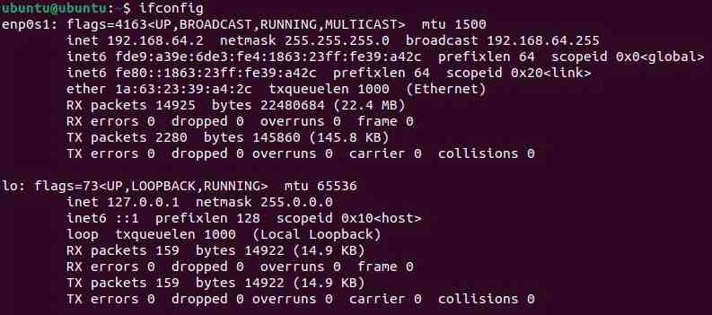
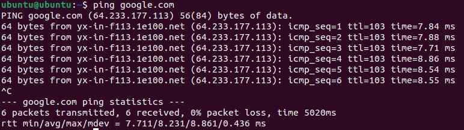
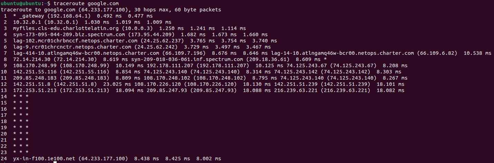
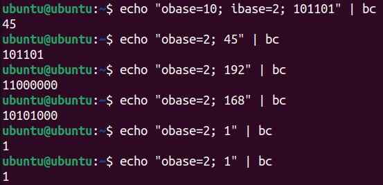
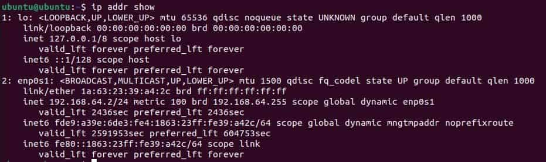
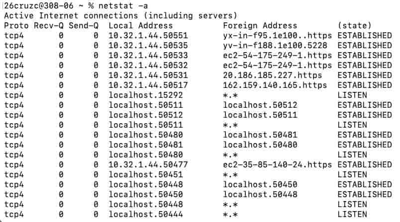

# Data Movement and Types of Networks

## Project Overview

**Problem Statement:**

Configuring issues in a network requires knowledge of how the data is actually transferred, and the path which that data takes to get from one location to the next. This activity examines the format of a network and each step with data takes to reach its desired destination.

**Objectives:**

- Learn the basics of a LAN and the components of a general network
- Know base conversions and how data is transferred in binary
- Know the OSI layers and their applications
- Analyze the path in which data is transferred by looking at hops
- Send information from one device to another on the same network

**Success Criteria:**

In Ubuntu, be able to analyze the movement of data in various ways, and send data through *ping* and *netcat*, as well as be able to receive data.

## Design & Planning

### Data Movement Notes

**LAN**

| Term | Definition | Additional Notes |
| ------ | ------ | ------ |
| LAN (Local Area Network) | A network that connects computers and devices within one building/campus | Lets devices share printers, files, internet connections, etc. efficiently |
| Host | Device that can send or receive data on the network | Has unique IP address |
| Switch | Connects multiple devices inside the LAN | Learns the address of each device plugged in; forwards data to only the intended device |
| Router | Connects LAN to other networks | Uses IP addresses to decide destination |
| Packet | Data travels in chunks called packets | Contain sender's IP (return address), receiver's IP (destination), payload (data transmitted) |
| IP Address | Identifies each device on a network | Unique for each device |

Here is an example configuration of a LAN, with arrows depicting the transfer of data:

**Number Bases and Applications**

Binary is useful because:

- All digital data is transmitted through binary/base 2
- Computer signals are either on or off, represented by 1 or 0 respectively
- On/off signals can store IP addresses, MAC (hardware) addresses, and packets

Binary:

- Each binary digit is a bit
- 8 bits = 1 byte
- 4 bits = nibble

IP addresses:

- E.g. 192.168.1.1
- Each division is an octet
- Each octet is 8 bits = 1 byte
- 4 bytes total
- 192.8.1.1 to binary: 11000000.00001000.00000001.00000001

Hexadecimal:

- Base 16
- Each hex digit = 4 bits, so you can split a binary string into sets of 4 to easily convert
- Shorthand way to read a long binary string

**Practice Conversions**

| Denary | Binary | Hex |
| ---- | ---- | ---- |
| 0 | 0 | 0 |
| 1 | 1 | 1 |
| 2 | 10 | 2 |
| 3 | 11 | 3 |
| 4 | 100 | 4 |
| 5 | 101 | 5 |
| 6 | 110 | 6 |
| 7 | 111 | 7 |
| 8 | 1000 | 8 |
| 9 | 1001 | 9 |
| 10 | 1010 | A |
| 11 | 1011 | B |
| 12 | 1100 | C |
| 13 | 1101 | D |
| 14 | 1110 | E |
| 15 | 1111 | F |
| 16 | 10000 | 10 |

Note that binary was given, and decimal and hex were found:

| Binary | Decimal | Hex |
| ----- | ----- | ----- |
| 11001000 | 200 | C8 |
| 101101 | 45 | 2D |
| 00001100 | 12 | C |
| 10101111 | 175 | AF |

The entries highlighted in **bold** were given:

| Denary | Binary | Hex |
| ----- | ----- | ----- |
| **597** | 1001010101 | 255 |
| 603 | **1001011011** | 25B |
| 255 | 0011111111 | **FF** |

**OSI Model**

OSI - Open Systems Interconnection

- Conceptual framework
- Each layer has its own job
- Understanding layers helps troubleshoot
- Helps understand how computers talk to each other

| Layer | Name | Description | Details |
| -- | ----- | ----- | ----- |
| 7 | Application | Email or browser |
| 6 | Presentation | Translates data (encryption and compression) | Ensures that data is in a usable form |
| 5 | Session | Manages connection | Maintains connections; responsible for controlling parts and sessions |
| 4 | Transport | Breaks data into segments | Transmits data using transmission protocols (e.g. TCP, UDP) |
| 3 | Network | Routes packages using IP | Decides which physical path the data will take |
| 2 | Data Link | Transfers frames via MAC | Defines the format of the data on the network |
| 1 | Physical | Any hardware (e.g. wires, signals, routers) and Wi-Fi | Transmits to raw bit streams over a physical medium |

| Step | What Happens | OSI Layer |
| ----- | ----- | ----- |
| Write and address message | IP address gets formatted for communication | Presentation/Application |
| Package is prepared and boxed | Data is broken into segments | Transport/Network |
| Person at post office sorts it | ? | Session |
| Delivery truck figures out the best route | Routers and switches address routing | Network / Data Link |
| Truck drives it down the road | Data travels through the cable fiber or Wi-Fi | Physical |

| TCP/IP | OSI | Functions |
| ----- | ----- | ------- |
| Application | 5-7 | Apps, HTTP, FTP |
| Transport | 4 | TCP/UDP, Segmentation |
| Internet | 3 | IP Addressing, Routing |
| Network Access | 1-2 | Physical & Data Link |

**MAC Addresses**

MAC Address - an address assigned to each physical device

- 6 pairs of hex digits
- 12 hex digits in total
- Each pair is separated by colons
- Unique to each device

### Roadmap Planning

To be inserted once project is finished

## Technical Development

### LAN Components

**Addresses**

After net-tools is installed, *ifconfig* can be run on an Ubuntu VM to display information about the VM's network interfaces.

Some important components displayed in this are under **inet, netmask, and broadcast**.

inet: The IPv4 address assigned to that specific device which allows the router to identify it

netmask: Determines which parts of the inet/IPv4 address identify the network and which identify the host

- Note that there are 2 possible states: 255 denotes that it identifies the network, and 0 denotes that it identifies the device
- e.g. 255.255.255.0 means that the first 3 divisions define the network

broadcast: allows messages to be sent among devices on the same network

**Sending/Receiving Data**

As examined before, the *ping* command sends several packets of data to a receiver address, and a signal that the data has been received is sent back.

Here are two uses of *ping*, one with DNS and one with the numerical IP address:

One important command which can be used to see the path that data travels is `traceroute`. Here is the command being used with *google.com*:

For interpretation of these results, see the respective section in **Testing and Evaluation**.

### Binary, Decimal, and Hexadecimal in Networking

While base conversions can be calculated by hand, they can also be done using a pipe command `| bc`. To convert between bases, the full command is `echo "obase=[OUTPUT BASE]; ibase=[INPUT BASE]; [NUMBER TO CONVERT] | bs`.

Here are some examples:

Consider the address *192.168.64.2/24*, that of the Ubuntu VM used in previous activities. This IP address is converted to decimal for humans to read, but the computer actually processes it in binary.

Note that the */24* represents the **subnet mask**, which determines how many bits of the IP address denote the network (in this case 24). The rest of the bits in the IP address represent individual devices on that network.

To see more specific information about the VM's IP address, the command `ipcalc 192.168.64.2/24` was also run:

This shows various information about the VM's IP address, most importantly both the decimal and binary forms of the address and netmask.

**Hexadecimal Use Cases**

Note that hexadecimal is also important in networking. 

To see an IP in hexadecimal, the command `printf '%02X%02X%02X%02X\n' 192 168 64 2` was used, with the resulting output **C0A84002**.

Note that each pair of hex digits corresponds to one section of the IP address.

MAC addresses also use hexadecimal, as discussed in the **Data Movement Notes** section. To actually find the MAC address, the command `ip addr show` can be run, and the MAC address will be written in hex labeled **link/ether**:

### Networking Between VMs

This activity involved working with a partner on two separate VMs to transfer data between the devices.

To start, the IP address of both devices was obtained by using *ifconfig*:

This is the output of the sender's VM (VM2), which has an IP address of **10.12.24.255**. Meanwhile, the receiver VM (VM1) has an IP address of **10.32.1.47**, which is not shown above.

To check if the VMs are able to connect, the *ping* command was used in VM2 to ping VM1:

As shown above, all of the packets (7) were successfully transmitted, and the average latency was approximately 0.75 ms, which is fairly short.

Next, the `netstat` command was used to communicate with other devices. To view the active connections which can be made through TCP and UDP, the command `netstat -a` was run:

An explanation for what is displayed can be found in the respective **Testing and Evaluation** section.

Finally, to transmit readable information, **netcat** was used. The command `nc -l 4444` was used on the receiving device to listen on port 4444 for any messages. Next, the command `nc 10.32.1.47 4444` was used on the sender VM to actually establish a connection to port 4444.

Once both were connected, the message "Hello from VM2!" was transmitted to the receiver. As shown below, the message was successfully sent and received:

Similarly to netstat, an explanation for this can be found in **Testing and Evaluation**.

### Roadmap Development

To be inserted once project is finished

## Testing and Evaluation

### LAN Components

For reference, here is the result obtained by the *traceroute* command:

Each row of output labeled 1-24 represents a hop, which is a singular stop which data makes in its path to the destination.

For each hop, the **hostname** (the IP address or name of the device which handles the data during that hop) is listed (e.g. _gateway, 10.32.0.1), along with the **latency times**, the time for data to reach that hop and be returned.

Note that high latency times mean slower response time, which could possibly be due to the data traveling large distances or possibly security checks.

Note that some lines have a \* character, which signifies that the router/device at that hop chose not to respond.

The first hop, *_gateway*, represents the LAN gateway, which is the connection to the VM's LAN. The next couple of hops (roughly 2-10) likely hold local routers and those held by the internet service provider. The hops following these until the final hop are internet backbone routers, which move data across large regions. Finally, the last hop is the server of the destination, which in this case is Google.

### Binary, Decimal, and Hexadecimal in Networking

Hexadecimal is important to use instead of binary in cases where data is very large. This data can be condensed into a readable format through hexadecimal, as each hex digit contains 4 bits.

While the decimal form of an IP address is readable to humans and only requires a maximum of 3 digits per section, it is never practically used in the actual operations of a computer. Meanwhile, binary provides what the computer actually reads, but it is long and hard to interpret. Hexadecimal is a good compromise between decimal and binary because it produces a short and readable format while also maintaining 4 bits per hex digit.

This next section will analyze the details of network and broadcast:

The network address denotes the start of a network, while the broadcast address denotes the end of that network. Thus, the addresses contained between these values are able to be allocated to endpoint devices in the network.

As shown above, the network address is *192.168.64.0*, so the **first usable IP address** is **192.168.64.1**. Similarly, the broadcast address is *192.168.64.255*, so the **last usable IP address** is **192.168.64.254**. Thus, there are a total of 254 usable IP addresses in the network.

### Networking Between VMs

As shown in **Technical Development**, this is the output when *netstat* was used:

It is important to know that netstat displays information relating to the Transport layer of OS (layer 4). In other words, it displays information about the transmission protocols. These protocols primarily include TCP and UDP, and they are used to communicate between devices.

As shown in the output, some ports are used to listen while others have an established connection.

This is the output when *netcat* was used to transfer a message between two VMs:

Similarly to netstat, netcat involves Layer 4 of the OSI, but it actually uses this layer to transfer information. Specifically, it uses the TCP protocol to deliver messages between the two endpoint devices, sending and receiving packets.

### Roadmap Explanation and Evaluation

To be inserted once project is finished

## Reflection

Through the *Data Movement and Types of Networks* activity, students learned the process by which data travels in a network and in what form that data is transferred. Students began to explore data travel by first examining the structure of a LAN (local area network), and how data is transferred within it. Next, The OSI layers were learned about to both contextualize data travel and generalize it to the internet as a whole. Learning the four TCP/IP layers allowed protocols to be applied to the different OSI layers, and using this broadened understanding of data transfer, data was actually transferred and received between two local devices. To see how this type of data was transferred, base conversions were also covered, showing how any data which is transferred over the internet is interpreted as bits. Knowledge of data transfer, especially the OSI layers, can help in real world networking drastically, as all problems in sending or receiving data can be traced back to specific layers of the OSI model, and problems can be dealt with on that level, narrowing them down. Knowledge of data transfer can also help common people to better set up networks, including options such as failsafe connections (connections to multiple devices to ensure that if one fails, a connection can still be made). A reasonable next step to take is examining protocols in further depth or exploring more how the internet outside of a LAN functions. Citations for this page include the various assignments assigned in AP Networking, as well as the Ubuntu VM.

**VM Lab Reflection**

*ifconfig* helped to get general information about the host device, including its internal IP address, MAC address, and network and broadcast addresses. *ping* was very useful in getting information about network connection, such as the average transfer rate of packages to the second VM (~0.8 ms), which implies that the two VMs were relatively close together. When actually transferring information through netcat, TCP allowed the information to be transmitted as packets between the two devices, facilitated the interaction, and ensured that the packets were sent completely. Note that in this activity, all of the OSI layers were used, as the user used the netcat application to send a message, and it was transferred to the receiving device through physical wires. 

**Roadmap Reflection**

To be inserted once project is finished