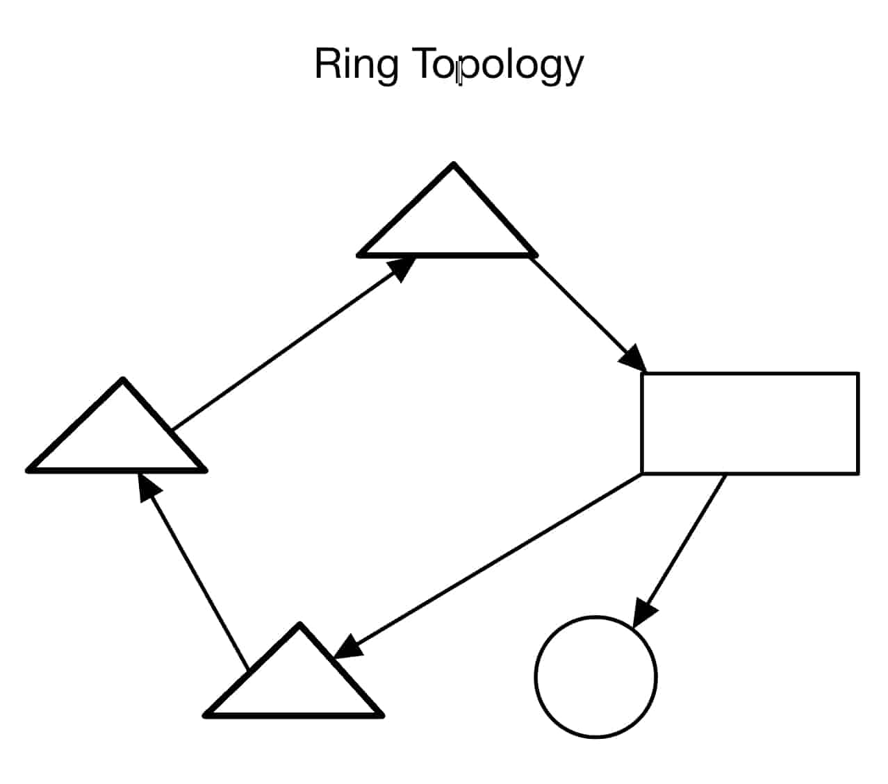
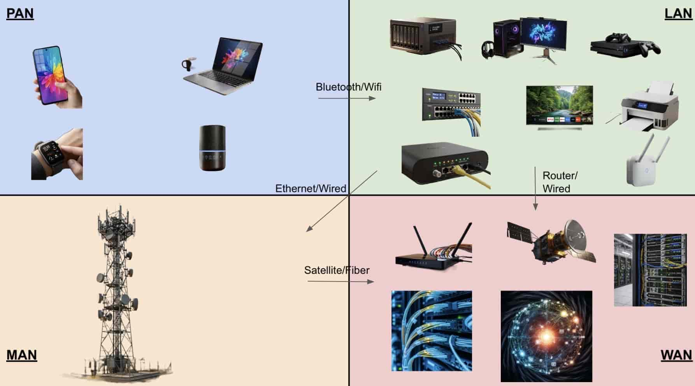
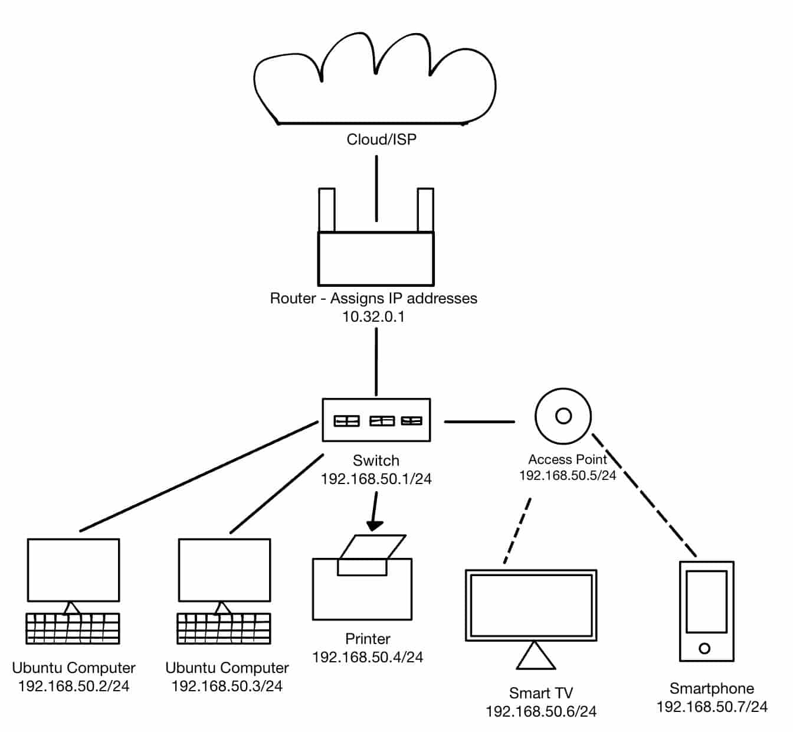
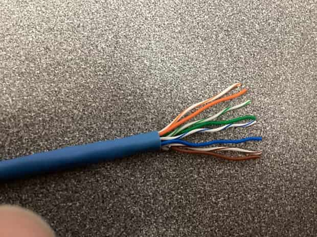
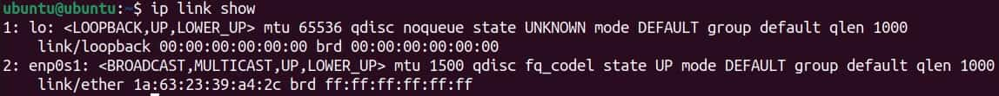
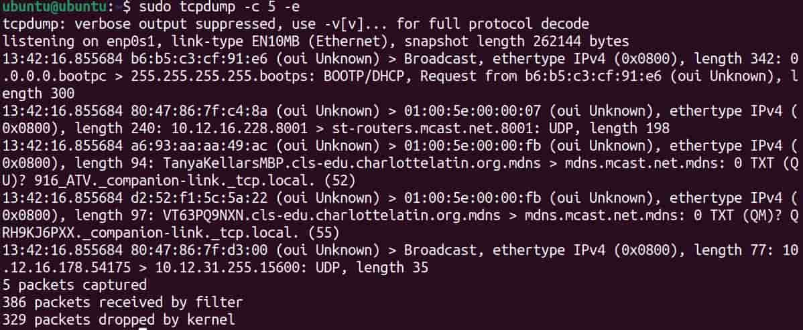
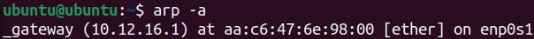
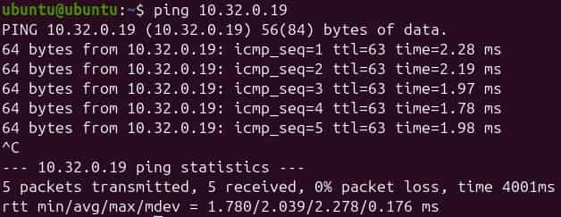
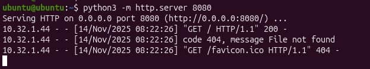

# Types of Networks & Connections and Devices

## Project Overview

**Problem Statement:**

While knowledge of how data moves is useful, many people do not know how to use that knowledge to create and maintain a reliable network. This activity details different network formats and how to ensure that data is transmitted precisely and is filtered properly.

**Objectives:**

- Compare IP addresses and the difference between internal and external IPs
- Examine different network topologies
- Construct an Ethernet cable for Layer 1 of the OSI Model
- Examine in depth Layers 1-2 of the OSI Model in Ubuntu
- Simulate a SOHO through interaction between several VMs

**Success Criteria:**

Through various Ubuntu and real-world activities, explore how networks work in general, focusing on Layers 1-3 of the OSI Model.

## Design & Planning

### Network Topologies

Network topology - a configuration of how devices are arranged and connected in a network which shows how data travels among devices

There are two ways to interpret a topology:

- Physical topology - shows the physical layout of devices (cables, devices, routers, switches)
- Logical topology - models data movement through the network, which could differ from the physical topology

Topologies are made up of:

- End devices - tools that people use
- Networking devices - devices that control the transfer of data between devices
- Cables/wireless connections - what data actually travels through

Here are the primary topologies of networks and an example diagram for each:

Key:

Star Topology - a central networking device with each end device connected to the central device

Bus Topology - a backbone cable with each device branching off of it

Ring Topology - the devices form a circle with their neighbors, with data travelling one way only

Mesh Topology - every device has connections to multiple others, creating redundancy and reliability

Hybrid Topology - combines two or more types of topology

**Reflection**

For a small business, a **star topology** would likely be **easier** to implement. This is because connections only have to be made between each end device and the respective networking device (usually a router/switch). Thus, a relatively small amount of connections have to be made, and data can still travel indirectly among all devices in the network.

However, to handle the case where **one connection fails**, a **mesh topology** would work best. This is because if a connection between two devices happens to fail, there will likely be a backup connection (usually indirect) between the devices which need to communicate.

The most **expensive** topology to implement would likely be a **mesh topology** since for the same amount of devices, it requires many more cables. Depending on how many connections are desired (a partial vs. full mesh), the amount of cables can increase much.

A **school** would likely use a **hybrid topology**, made up of a star topology of switches with a star of devices with respect to each switch. This allows for centralized control of groups of devices, while also allowing management of each switch individually via the primary router.

The physical layout of a topology greatly affects speed because wires can be very long, and indirect connections could require going through several of these wires, increasing the time for data to be transferred through these wires (or through WiFi). Also, if a wire is faulty or disconnected, then depending on the layout, devices could become inaccessible.

### Connections That Share Data and Resources

For this activity, it is useful to know what a PAN, LAN, MAN, and WAN are.

| Term | Definition|
| ---- | ---- |
| PAN | Devices communicate within a very small range of a person (a couple of meters) |
| LAN | Devices communicate within a small area, usually a building or a couple of buildings |
| MAN | Covers larger areas than a LAN (usually cities or larger areas) |
| WAN | Spans a very large area (e.g. a country) |

Below is a diagram which represents how devices interact between PAN, LAN, MAN, and WAN:

**Reflection**

On a day to day basis, all of these networks are used. A PAN is used for interaction between, for example, a cell phone and smartwatch, while a LAN is used on a home Wi-Fi network. A MAN is used to provide cellular data to a phone, and a WAN is used to gather information from the internet as a whole when performing actions such as browsing. A PAN usually connects to a LAN or MAN, mostly through Bluetooth or Wi-Fi, and a LAN, MAN, and WAN connect to each other through satellites, fiber cables, and other means. This activity ultimately displays that as the scale of a network increases, although it can handle more devices, the cost also increases because there must be many more connections between devices, while speed might also decrease because of this increased amount of connections.

### Building and Testing a Small Office/Home Office (SOHO) Network

A SOHO network is a network setup which is commonly used in a home or a small business. Note that SOHOs usually include a modem, router, switch, access point, and devices.

Below is an example model of a SOHO network:

## Technical Development

### Exploring IP Addresses in Shared and Bridged Mode

**Shared Mode**

This is the output when running `ip a` in shared mode:

As shown above, the IP address in shared mode is **192.168.64.2/24**. 

Note that since this command was run in shared mode, a virtual subnet defines the network. It is also important to note that this is the **internal** IP address, which defines a device relative to the home network.

This differs from what is displayed when going to [this website](https://whatismyipaddress.com).

This displays the external IP address, **173.95.44.210**, which defines a network with respect to the internet as a whole.

**Bridged Mode**

Note that when switching to Bridged mode, the *Bridged Interface* must match that of the Mac's active connection the the router (WiFi/Ethernet).

This is the output after running `ip a` in bridged mode:

Thus, the internal IP address when on bridged mode is **10.12.25.220/20**.

Bridged mode allows the VM to act as a device on the same LAN as the host system. However, it is classified as a separate device to the host.

When checking the external IP address, it turned out to be the same as in shared mode:

The IP address is exactly the same as the external address in shared mode, that being **173.95.44.210**. Thus, it is likely that the external IP address is defined based on the closest layer to the internet, which is the router of the host system in both cases.

To see more detailed analysis and reflections on Shared and Bridged mode, see the respective section in **Testing and Evaluation**.

### Cable Constructing and Testing

This activity involved creating an Ethernet cable, which works at Layer 1 (Physical) of the OSI, converting data into bit streams.

To start this activity, a section of Cat5e cable was cut, and roughly 1 inch of the jacket was stripped from each side:

Then, on one side, the pairs of wires were untwisted and arranged in T568B color order (White/Orange, Orange, White/Green, Blue, White/Blue, Green, White/Brown, Brown) and straightened:

Next, an RJ45 connector was taken and attached to one end of the Ethernet cable, ensuring that all of the wires remained in their respective T568B order. Note that this was the most difficult part of the process:

Next, the RJ45 connector was placed into the crimping slot of a Solsop tool, and its end was crimped. Note that this step required a slight overhang of wires:

Once crimped, a jacket was placed on the RJ45 connector, and another jacket was placed on the inside of the wire for the other end.

The above process was repeated for the other end of the wire, thus creating a finished Ethernet cable:

Here is a video of stripping and preparing the wires:

INSERT STRIPPING DEMONSTRATION

Note that other checkpoints and a reflection can be found in **Testing and Evaluation**.

### OSI and TCP/IP - Layers 1 and 2

This activity involves an exploration of layers 1 and 2 (Physical and Data Link) of the OSI layers. To begin this, an Ubuntu VM was connected to the internet, and a network connection was confirmed via `ping -c 3 google.com`.

**Data Link Layer**

To start, the active interface was found, and its information was displayed using `ip link show`:

The following information was obtained:

**Interface Name:** enp0s1
**MAC Address:** 1a:63:23:39:a4:2c
**Broadcast Address:** ff:ff:ff:ff:ff:ff

Note that the interface references the virtual network card of the VM, and the MAC address uniquely identifies the computer on the LAN. The broadcast address is used to send messages.

Next, the command `arp -n` was used:

As displayed above, the IP address, MAC address, and interface of devices on the same LAN are shown.

Next, the `ip -s link` command was run to show data transmitted and received by the VM's interfaces:

For the active interface enp0s1:

**RX/Received Packets:** 6671
**TX/Transmitted Packets:** 1287
**Errors:** None

**Physical Layer**

To check details about the physical layer (actual hardware), `sudo ethtool enp0s1` was run:

The following stats were found:

**Speed (Mb/s):** 1000
**Duplex:** Full
**Link Detected:** Yes

The speed details how fast the link is. Duplex showed that data travels in both directions in this case, and the detection of a link shows that the VM is connected.

Finally, to analyze network traffic, `sudo tcpdump -c 5` was used to get 5 live packets:

The following information can be inferred from the output:

**Source MAC Address:** b6:b5:c3:cf:91:e6
**Destination MAC Address:** ff:ff:ff:ff:ff:ff
**Protocols Used:** Ethernet, BOOTP/DHCP, UDP, IPv4

To summarize the above, the source MAC address is **b6:b5:c3:cf:91:e6** while the destination MAC adddress is **ff:ff:ff:ff:ff:ff** (the broadcast address). The packets transferred are likely packets which are required for the maintaining of certain protocols or connections to the internet. This data is important for troubleshooting and network monitoring because it ensures that a stable connection is being maintained, and it shows each step of data transmission. Thus, problems can be pinpointed to certain IP and MAC addresses.

Note that reflections and comparisons can be found in **Testing and Evaluation**.

### Building and Testing a Small Office/Home Office (SOHO) Network

Note that connectivity in the LAN was checked in the respective **Testing and Evaluation** section.

To explore the network, two commands were used (`arp -a` and `netstat -r`).

The `arp -a` command lists nearby devices on the LAN by MAC address, which shows that devices in a SOHO network identify each other by MAC address.

The `netstat -r` command displays how data is sent through the network, showing each active connection and the respective protocols used. Thus, this reveals that a SOHO often requires many connections into and out of each device for its general function.

Next, to prevent unwanted connections, a firewall was enabled for the SOHO. To do this, `ufw` was used. The UFW firewall was disabled, so the command `sudo ufw enable` was used to enable it:

A firewall is necessary in a SOHO because it is able to filter any packets which are deemed malicious or unnecessary, preventing many hacks and speeding up data transfer due to the filtering of connections.

Another VM was then created (Ubuntu 25.10) to ensure that every VM has a unique IP address and can commmunicate with others.

To check connectivity between VMs, another VM was pinged:

Since packets were successfully transmitted and returned, the connection was successful.

To visualize how data travels to reach its destination, `traceroute google.com` was used to show the transmission of data to and from Google:

This shows that data travels to a network by eventually passing through a primary router, which moves the data to the destination (in this case Google). This transmission also happens very quickly, as it only took a maximum of 10 ms for each hop.

Next, one VM hosted a server using the commands `cd ~` and `python3 -m http.server 8080`, establishing a server on port 8080:

Using the host VM's IP address, on a client VM, `http://10.32.0.19:8080` was typed into a web browser to see the files hosted:

This demonstrates the Application Layer by showing how one device can serve files to another over HTTP.

Note that more detailed testing and reflection can be found in **Testing and Evaluation**.

## Testing and Evaluation

### Exploring IP Addresses in Shared and Bridged Mode

Shared Mode Reflection:

When comparing the two IP addresses, they are completely different. The IP address **192.168.64.2/24** thus belongs to the local network, while the address **173.95.44.210** belongs to the internet. Overall, a virtual machine may use NAT/Network Address Translation if it wants to connect to the internet if the VM should be contained and managed by the host system. NAT is necessary in this case because the virual subnet containing the VM must route data to the Mac's network and out to the internet. Shared mode in general makes it easier to connect multiple virtual machines on one computer because they are all centralized under the Mac. This allows for permissions to be managed and artificially defined using the virtual subnet created by the host system.

Bridged Mode Reflection:

The internal IP address greatly changed when switching to bridged mode. In bridged mode, the device is defined relative to the Mac's network rather than a virtual network created by the Mac, so it is expected to be different. However, the external IP address remained the same regardless of which mode was used. In bridged mode, a VM ultimately acts more like a separate computer because it directly connects to the same router as the Mac, rather than acting as part of the Mac. Overall, Bridged mode may be chosen by corporations and users in general to allocate a computer's resources to VMs acting as individual devices, using time and cost efficiently. However, bridged mode carries a risk because it is not able to be managed by the host system. As such, actions can be performed which may make the host system's network vulnerable because no virtual subnet exists to contain these vulnerabilities.

**Overall Comparison**

| **Mode** | **Internal (Private) IP** | **External (Public) IP** | Notes |
| ---- | ---- | ---- | ---- |
| Shared (NAT) | 192.168.64.2/24 | 173.95.44.210 | Internal IP is defined independent of the host's network; External IP is defined by the host's network |
| Bridged (NAT) | 10.12.25.220/20 | 173.95.44.210 | Internal IP is defined by the host's network; External IP is defined by the host's network |

Bridged mode made the VM appear as its own device on the local network, while Shared mode provided a safer and more controlled environment. Overall, NAT helps to manage limited IPv4 addresses because it centralizes them under a virtual subnet and allows for the configuration of that subnet through the host device. This configuration and management also creates a more secure environment. In shared mode, data travels from the virtual machine to the host system's virtual subnet, then to the host system's LAN, then to the internet. Meanwhile, in bridged mode, data travels from the virtual machine directly to the host system's LAN, then to the internet. In both of these cases, the host system's LAN must be passed through, so this is what defines the external IP address of the VM in both cases.

**Reflection**

To summarize the information above:

The internal IP address differed while the external IP address remained the same between Shared and Bridged mode. Ultimately, this activity revealed that local networks may be created inside of other networks, creating a chain of data movement between an endpoint device (such as a VM) and the internet. The internal IP address is defined with respect to the lowest layer (that of the endpoint device), while the external IP address is defined with respect to the highest layer (usually a router). IT professionals may use different network configurations depending on the situation to manage efficiency vs. security. In a home or lab, it may be better to use a shared environment since endpoints are contained within a more secure network. This is in general useful for dealing with secure information. However, in business and tasks that require heavy use of resources, a bridged environment may be better. However, this has the downside of possibly introducing new vulnerabilities to the host's network. In the classroom, bridged mode is likely better to use since it better simulates a real computer, thus replicating real-world scenarios better. Since a classroom environment likely does not store any sensitive data, then the risks associated with bridged mode are not significant.

### Cable Constructing and Testing

The cable created in **Technical Development** was tested in a cable tester by placing one end into its main unit and the other end into its remote unit:

INSERT CABLE TESTER VIDEO

As shown above, the indicator lights successfully cycled in order from 1 to 8, thus showing that the cable passed the test. This result heavily matters because if the lights were out of order, then data could be incorrectly transmitted to the wrong location across that cable.

The cable was also labeled by the user's name and its type:

**Reflection**

The most challenging step in constructing the cable was placing the eight individual wires into the RJ45 connector. This step was especially difficult because of the precision required to place each wire in the correct slot and to avoid other correctly placed wires from coming out. Maintaining correct wire order is critical for network reliability because incorrect wire order could lead to corrupted data or transmission to the wrong destination. Building and testing cables connects to the Physical Layer of the OSI Model because these cables are what physically transmit bit streams of data between devices. If a cable in a real network is built incorrectly and not tested, then this could cause failed or inconsistent packet transmission, causing problems for any transmission requiring a path through that cable. Labeling the cable and using the tools to create the cable mirrored real-world practices because cables made in the real world are often labeled by type for convenience to users. Furthermore, the development of cables also requires testing through means such as a Cable Tester (though this process is likely automated).

### OSI and TCP/IP - Layers 1 and 2

This activity revealed that a network interface is able to uniquely identify itself on a LAN via its MAC address since a MAC address is uniquely assigned to every hardware device. A MAC address is different from an IP address because an IP address is assigned with respect to the LAN, while the MAC address is already encoded into a hardware device. Thus, an IP address is variable while a MAC address remains constant (unless in a virtual environment). ARP helps the computer link layers 2 and 3 of OSI because it displays each IP address on the network (layer 3) with its respective MAC address (layer 2), showing the link between those two. When viewing live packets in tcpdump, it was shown that various protocols were necessary for the transmission of data, and that packets have to travel through various hops to get to their destinations. Ultimately, layer 2 provides the MAC address which details where packets must go, and layer 1 actually moves those packets through physical media to that device, and vice versa.

**What Was Learned about OSI Layers 1 & 2**

Layer 1 is different from Layer 2 of OSI because layer 1 deals with the physical transmission of packets while layer 2 deals with their routing to the correct device. However, layer 2 is necessary to show where physical data (as bit streams) must actually be transported. The `arp -n` command helped to understand the data link layer (Layer 2) much better because it showed each interface and their respective MAC and IP addresses, showing how each device is uniquely identified. `ethtool` broaden the understanding of the physical layer (Layer 1) the most because it showed statistics of the physical transmission of packets, such as speed and whether they could move in both directions. Understanding these two layers is very important for anyone working with networks because it can help the user configure networks in optimal ways for data transmission, and this knowledge helps with debugging when packets fail to transmit between devices.

### Building and Testing a Small Office/Home Office (SOHO) Network

To test connectivity between devices in the LAN, the IP addresses of two devices were obtained via `ip a`:

Computer A: **10.32.0.19**

Computer B: **10.32.1.47**

Next, the `ping` command was used to ensure that data could be transmitted between them:

Computer A:

Computer B:

**Reflection**

The creation of a SOHO demonstrates that devices communicate on a network by passing through the router, which either sends that data to the cloud or to another device on the network. When using `ping` and `traceroute`, Layer 3 of the OSI Model was active, while both Layers 2 and 3 were active when using `arp -a` and `netstat -r`. When activating the `ufw` firewall, Layers 3 and 4 were active since packets were filtered. Finally, the hosting of a server acted mainly on Layer 7 since an application (Firefox) was able to display transmitted data. In general, enabling a firewall protects a SOHO network because it is able to filter incoming packets based on a set of user-defined rules. The amount of hops required during `traceroute` (21) was very surprising, as the amount of devices used was expected to be much lower. Simple web server activity display how real-world websites work because they show the file structure backbone of those websites, which simply use web-formatting tools to display that data in a desired format. If this were an actual home network, more devices would have to be added, and actual computers (rather than VMs) should be tested with the network. Also, a switch and access point may have to be set up due to the existence of many wired devices and several wireless devices on a real SOHO.

## Reflection