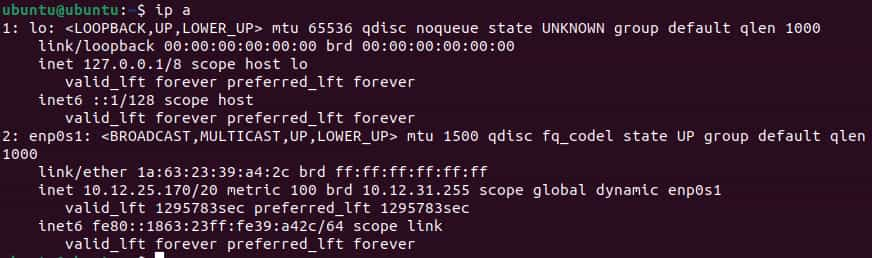
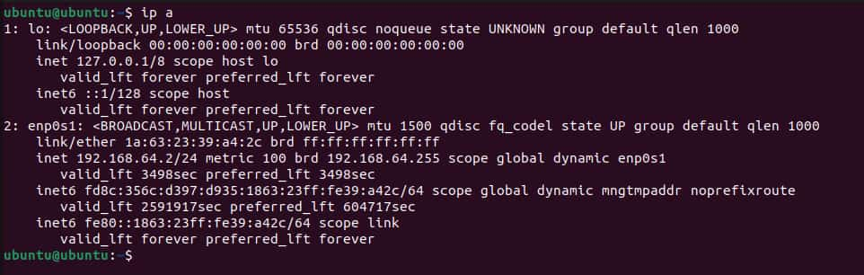

# Why Can't These Two Computers Talk to Each Other?

**Physical Layer Check (Layer 1)**

To start, an Ethernet cable was plugged into both Mac desktop devices.

`ip a` was run on both devices. Here is the respective output:

As seen above, both VMs had **state UP** listed, so **Layer 1 is active and functional**.

**Data Link Layer Check (Layer 2)**

This is the output when trying to ping Computer 1:

When trying to ping this VM, this virtual machine experienced successful transmission.

This VM completely failed to transmit packets.

Since the VMs had the same virtual NIC, communication failure is expected. However, it can be concluded that one VM was in a subnet which was part of the network of the other VM. Thus, communication via IP address should happen half of the time, which correlates with what was obtained. 

**Network Layer Check (Layer 3)**

When running `ip a` again, the same outputs were produced:

The IP addresses of the VMs are not identical. 

Even if the IPs match, the VMs might not be on the same network. This is because they could have different virtual switches, which assign internal IP addresses using the same naming conventions.

In general, Layer 3 addressing cannot work under this configuration because the VMs are not part of the same subnet. Since they are both on their own virtual subnets, then using the internal IP address of the other VM will not work, as the virtual router/switch must first be accessed before referencing the internal IP or MAC address. 

**Testing Ping Again (Confirming Failure)**

Next, ping was tested again, confirming failed communication on one VM and successful communication on the other:

Thus, this is confirmed to be a failure in OSI layers 2 and 3. This is because the physical connection was found to have **state UP**. Meanwhile, the MAC addresses were shown to be the same, which means that the VMs used duplicated NICs, causing communication failure. Furthermore, the devices are also on different virtual subnets, preventing communication via internal IP addresses.