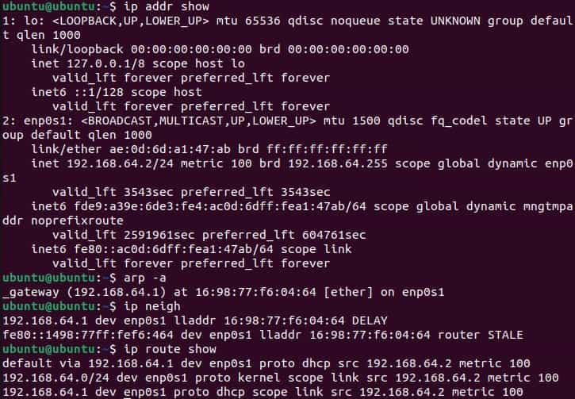
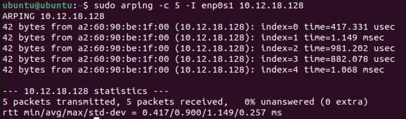
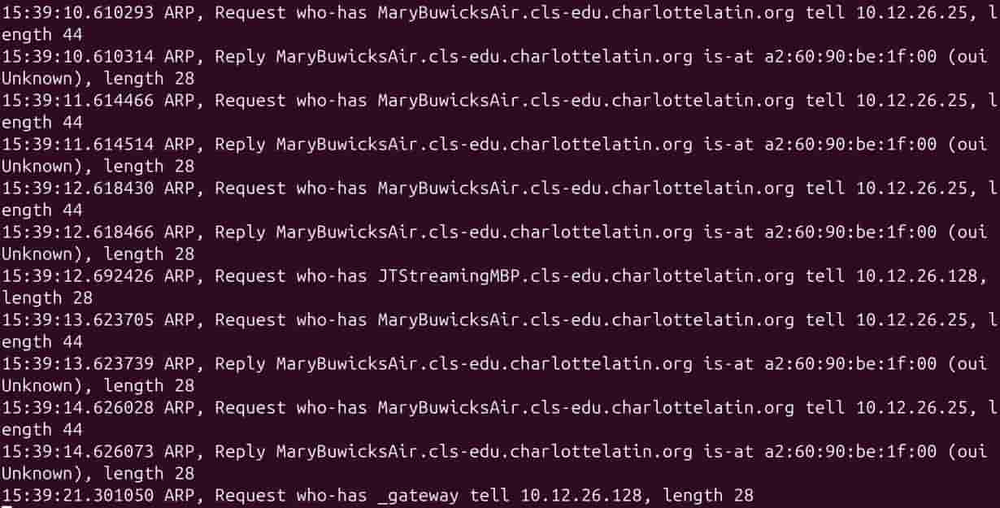
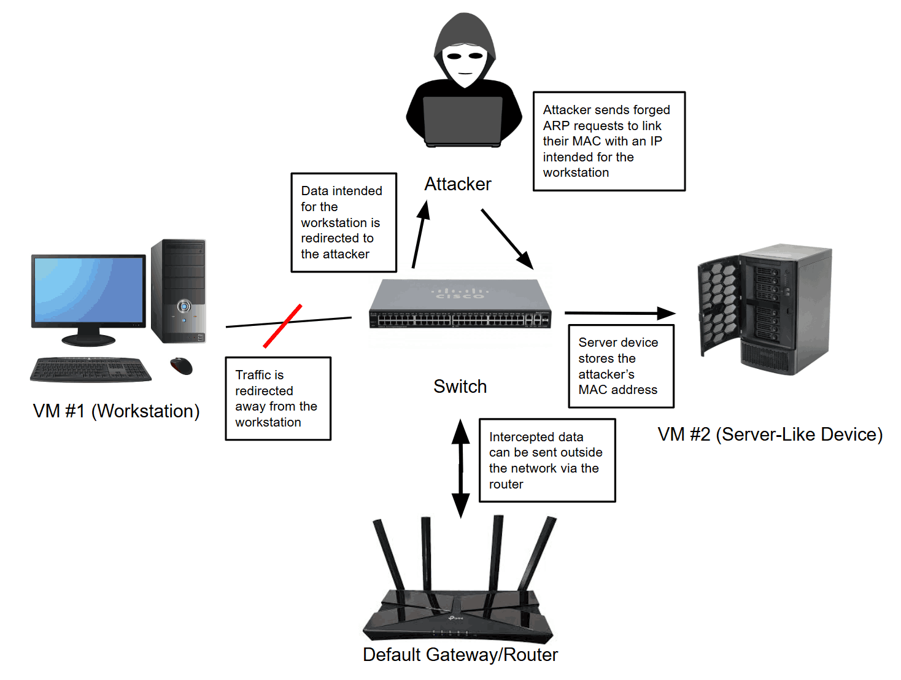

# Determining Security Controls in a LAN

## Security Controls to Mitigate Vulnerabilities in a Switched LAN

The following assessment report assesses and provides controls for the security of a school LAN.

[School LAN Assessment Report](../papers/Cruz-AssessmentReport-SwitchedLAN.pdf)

## Project Overview

**Problem Statement:**

Given weak security controls, vulnerabilities in networks are able to be exploited, allowing access to sensitive data and administrative privileges.

**Objectives:**

- Understand common LAN vulnerabilities and how to detect them
- Know controls for each vulnerability and the weaknesses of such controls
- Assess the security of a given system and be able to suggest controls

**Success Criteria:**

Through several assessment reports and analysis of ARP information, understand and suggest solutions to possible vulnerabilities on a network without proper security controls.

## Planning and Design

### Common Security Controls in a LAN

**LAN Threat Scenarios**

Note that these interpretations may be incorrect, as this was the part of the introduction to these topics.

| **Scenario Letter** | **Symptoms Summary** | **Hypothesis** | **Justification** |
| -- | -- | -- | -- |
| A | A device suddenly receives the wrong gateway | The switch which the device is connected to changes its broadcast address | If the broadcast address of a switch is changed, then a device connected to it would connect to the switch, and this data would be diverted to another router |
| B | The switch CPU spikes; many MAC addresses appear on one port | An attacker requests IP addresses on many devices from the same router | The device cannot accept any more devices, and devices on the network cannot communicate |
| C | Clients receive IPs from an unexpected source | The network settings may not be secure, so the device is easier to attack | The source is unknown, so settings might not be very secure |
| D | A new unknown device appears inside the broadcast domain | The security for letting devices join the network is weak | Someone would be able to connect more easily without valid credentials, causing risk to data |
| E | A host begins reaching other internal hosts it should never reach | The host is accidentally connected to an internal router | This allows access to internal devices since it is under the same DHCP |

The most likely explanation to be correct is explanation D. While this may not be the entire explanation, weak security controls are likely at the core of this problem. The hardest scenario to interpret would be many MAC addresses appearing on the same port. This is because nothing discussed before has covered multiple MAC addresses on the same port, and the understanding of ports in general is weak. Talking with another pair strengthened these hypotheses because they were able to be combined and refined to create more empirical hypotheses. Across all of these scenarios, the overarching cause could be attributed to weak security configurations, specifically on the router or switch.

**Five Common Internal LAN Threats**

- ARP Spoofing: sending fake ARP messages to associate the attacker's MAC address with a valid IP address; ARP spoofing takes advantage of the assumption that ARP table entries are all valid.
- MAC Flooding: flooding the switch with messages from random MAC addresses to overflow the MAC address table; MAC Flooding takes advantage of the limited maximum capacity of a CAM table.
- Rogue DHCP Server: an unauthorized device distributes false IP addresses to devices on a LAN; A rogue DHCP server takes advantage of devices trusting any DHCP vendor.
- Unauthorized Plug-In Device: an attacker's device is connected to a network port without permission; Unauthorized plug-in devices take advantage of a switch/router trusting that connected devices are verified.
- Lateral Movement: an attacker gains access to one device in the network and moves across the network to gain access to data and permissions; Lateral movement takes advantage of the switch trusting that verified devices will remain uncompromised.

## Technical Development

### Common Security Controls in a LAN

**Task A - LAN Observation**

Note that this activity was performed on the Ubuntu Desktop VM.

The following outputs show, in order, the network interfaces and subnet, the ARP cache, a neighbor table, and routing information.

From these outputs, the following are found:

**Subnet:** 192.168.64

**Default Gateway:** 192.168.64.1

**Visible Hosts:** 16:98:77:f6:04:64 (gateway), fe80::1498:77ff:fef6:464, 16:98:77:f6:04:64

**ARP/Neighbor Table Entries:** 16:98:77:f6:04:64 (gateway), fe80::1498:77ff:fef6:464, 16:98:77:f6:04:64

The ARP table and the neighbor table have very similar entries, which is a pattern suggesting that neighboring devices are likely communicated with recently. The interface of each device also shows in several of the outputs, suggesting that the interface is an important part of device identification.

An attacker could misuse the information gained from an ARP table because they would be able to find the MAC addresses of valuable devices, which could be found and manipulated. They could impersonate a device by statically assigning their IP address to the same IP address, or by changing their device's virtual MAC address. Thus, any traffic to the targeted device could be redirected to their device since a LAN cannot distinguish between two devices with the same MAC address.

**Task B - Match Observations to Possible Threats**

Two of the outputs above were chosen: the ARP table entries (`arp -n`) and the gateway information (`ip route show`).

Below is an explanation of the threats provided by gaining access to these:

| **Evidence from your VM** | **Possible Threat Enabled** | **Why?** |
| -- | -- | -- |
| ARP Table Entries | ARP Spoofing | ARP spoofing involves associating an attacker's MAC address with one in the network (which is located in the ARP table), so an attacker could obtain a MAC address to copy |
| Gateway Information | Unauthorized Plug-In Device | Knowing gateway information could allow a device to connect directly to a network, bypassing security controls. This could also allow for administrator privileges to be gained without permission |

To see the analysis of a specific threat and conclusions from the evidence provided (Task C and reflections), see the respective section in **Testing and Evaluation**.

### Appropriate Security Controls/Common Vulnerabilities Within a Simple LAN

**ARP Inspection**

This activity involves the observation of ARP information inside of a LAN, displaying how easy it is to collect and manipulate this information.

VM #2 (the Linux virtual machine) acted as a server, while VM #1 (the Ubuntu VM) acted as a host device.

The interface information of the server VM was obtained via `ip addr` and `ip route`:

The following information can be determined:

**Interface Name:** enp0s1

**IPv4 Address:** 10.12.18.128

**Default Gateway:** 10.12.16.1

On the server VM, `sudo tcpdump -i enp0s1 arp` was run to start listening for ARP traffic, and this terminal was left running.

The host device VM then broadcast ARP requests searching for the IP of the server VM via `sudo arping -c 5 -I enp0s1 10.12.18.128`:

As shown above, all packets were transmitted successfully, implying that the server VM successfully responded with its MAC address.

This can be confirmed by analyzing the `tcpdump` output on the server VM, displaying that the requests for its IP address were paired with a reply:

The interpretation of these results can be found in the respective section in **Testing and Evaluation**.

**LAN Attack Path Diagram (Homework)**

The following diagram represents ARP spoofing:

The means through which ARP spoofing infiltrates an unsecure LAN and possible control methods can be found in the respective section in **Testing and Evaluation**.

### Physical Security Controls for Network Devices and Physical Spaces

This activity considers the security of a large medical pharmaceutical research company.

**Enterprise Physical Security Threat Analysis**

A pharmaceutical research environment may have the vulnerability of unauthorized access to the buildings themselves, as well as to certain areas in those buildings. This vulnerability specifically exists in the perimeter and primary entrances of the pharmaceutical research facility. Allowing access to buildings without permission could lead to tampering with equipment and the potential destruction and theft of property.

Access to the facilities may also not have the ability to be monitored, causing uncertainty on who is present on-site. This vulnerability affects the entirety of the facilities, as it is important to log who enters and leaves at what times. Failure to monitor access could lead to parties entering and tampering with equipment without being noticed.

Given the storage of medical substances and network control systems, temperature and humidity also pose a major vulnerability to this environment. This vulnerability applies to the research laboratories on account of the storage of chemicals, the on-site ata center, network closets, and controlled lab spaces. This presents much risk because incorrect environmental conditions could damage server devices or render certain drugs or chemicals ineffective.

With the existence of server devices and network closets, a lack of access controls to these systems is a major vulnearbility. This vulnerability affects any device which has elevated permission in the research center's network. If one were to gain access to the network closet or the ports of one of these elevated devices, they could cause harm to the network and gain access to other devices, which may hold sensitive information.

If employees are not verified or adequately trained, then they could internally pose risk to the facility, especially with elevated permissions. This vulnerability applies to all parts of the company, as any staff member could cause harm. A staff member could potentially leak company information to competitors or the personal information of test subjects.

Visitors from other companies or manufacturers to the company are a vulnerability if not vetted properly. This vulnerability could affect areas where visitors may go and anywhere where materials from outside manufacturers might be implemented. Non-vetted manufacturers could lead to the development of faulty equipment or unauthorized information being gained inside the facility, and unmonitored visitors could reveal confidential company information.

**Physical Security Plan - Pharmaceutical Research Facility**

To address the vulnerability of susceptibility to environmental pressures, environmental controls must be implemented. Moisture indicators can ensure that there is minimal moisture damage from humidity or other factors to equipment, and temperature readers can ensure that server equipment does not overheat. Fire extinguishers and automatic sprinkler systems will ensure that fire damage is minimal.

INSERT FINISHED ASSIGNMENT

## Security Controls to Mitigate Vulnerabilities in a Switched LAN

Here is the suggested VLAN redesign for the school LAN:

## Testing and Evaluation

### Common Security Controls in a LAN

**Analysis of Both VMs**

Both of these screenshots display the ARP table entries for the respective virtual machine (Ubuntu Desktop and Linux Server). This information would be valuable to an attacker because having ARP table entries could allow for false ARP packets to be sent based on that table, creating false IP to MAC address pairings.

**Final Reflection**

Lateral movement is likely the most difficult of the five common LAN threats for a network administrator to detect. ARP spoofing and MAC flooding can be dealt with via controls such as DHCP snooping and dynamic ARP inspection to verify the validity of devices, as well as simply analyzing the ARP table using commands such as `ip neigh`. Rogue DHCP servers and unauthorized plug-in  can also be easily detected due to noticing abnormalities in IP addresses through `ip addr` or unrecognized neighbors. Lateral movement would be hard to detect comparatively because the attacker would be viewed as a verified device, and it can only be tracked by detecting suspicious activity from the respective device.

### Appropriate Security Controls/Common Vulnerabilities Within a Simple LAN

**ARP Inspection**

The following was interpreted from the results of the ARP request and viewing of all ARP messages:

ARP reveals the corresponding MAC address paired to each IP address in a LAN, as well as identifies every device on the LAN. ARP assumes that devices are trustworthy because it is difficult to prove that a MAC address is unverified without other protocols or controls in place. This makes ARP vulnerable to spoofing because if an attacker were to respond to send an ARP packet with an incorrect MAC address, then the attacker's device would be trusted and associated with a valid IP address. Bridged mode was required for this lab to work because ARP can only communicate within its designated LAN.

**LAN Attack Path Diagram**

ARP spoofing succeeds when no internal security controls are present because there is no verification of whether a MAC address is an authorized device on a network before assigning it a valid IP address. Dynamic ARP Inspection (DAI) would best mitigate this attack because DAI checks every ARP message, ensuring that the MAC address to IP address pairing is valid. Thus, the pairing would be found to be invalid since the MAC address of the workstation should connect to the respective IP address, preventing the attacker from being supplied a valid IP address.

## Reflection

INSERT THIS LATER